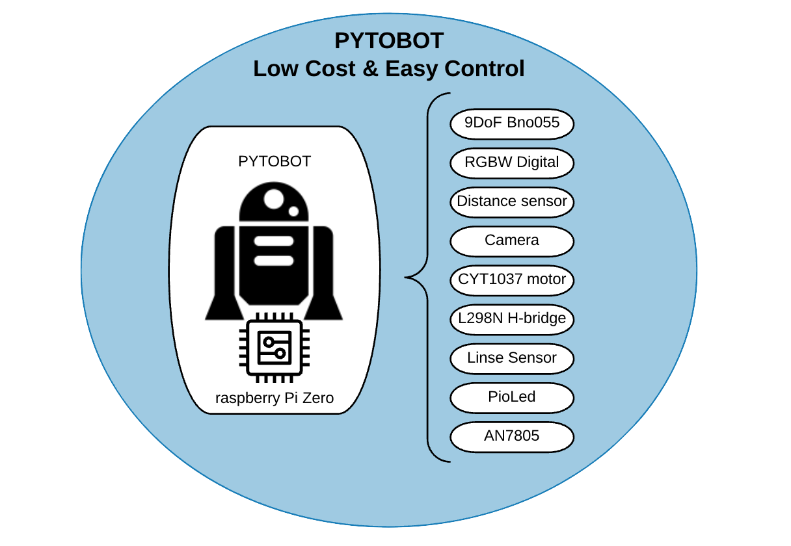

# Multi control open source robot for universal programming education \[PYTOBOT\]

## Intro

**Pytobot** is a DIY 3D-print **low-cost Rover** that will bring you step by step into the world of IOT.   
It takes electronics, 3D modeling and IOT together into a tailor-made **project for 10-16 year olds.**

**Programming** can be quite overwhelming for starters. With the Pytobot we want to make the step smaller and make programming more **accessible for children**.   
With a full **REST interface** that controlls the robot, you will be able to have control on multiple ways for different levels of programming. 

## Communication and Control 

The Pytobot is build on a **REST interface and JSON communication**.   
What gives us the advantage that the Pytobot can be **controlled** from **any framework and program** thats connected to the network. 

### Network

The connection with the Robot goes by connecting to the hotspot from the raspberry Pi.   
You will be able to read the SSID and password from the Oled screen. 

When connected to the hotspot. A browser will open with the toturial and startup config to control the Robot.

## Education and purpose

The Pytobot is an Low cost & Easy control device. What makes programming and configuring the robot acceceble for everyone at every programming level. 

The Pytobot is devided in 2 departments:

* Hardware
* Programming

## What's Included

### hardware

* Raspberry Pi Zero W
* [9DoF BNo055 ](https://learn.adafruit.com/adafruit-bno055-absolute-orientation-sensor/overview)
* RGBW Digtial Led Strip
* RGBW Neopixel Ring
* Distance sensor
* Wide lens camera
* [Micro Servo](http://www.ee.ic.ac.uk/pcheung/teaching/DE1_EE/stores/sg90_datasheet.pdf)
* [CYT1037 motor](https://www.sparkfun.com/products/13302?_ga=2.93423325.136307397.1555493489-1667146737.1552666307)
* [L298N H-Bridge motor controller](https://www.sparkfun.com/datasheets/Robotics/L298_H_Bridge.pdf)
* [QRE1113 Line Sensor](https://www.sparkfun.com/products/9453)
* [PiOLED Adafruit](https://www.adafruit.com/product/3527)
* [switch](https://www.sparkfun.com/products/8837)
* [AN7805 DC/DC converter](https://industrial.panasonic.com/content/data/SC/ds/ds4/AN7800_E_discon.pdf)
* [RFNL10 TJ6s](http://d1d2qsbl8m0m72.cloudfront.net/en/products/databook/datasheet/discrete/diode/fast_recovery/rfnl10tj6s.pdf) diode
* [Mosfet \(SW\)](https://www.infineon.com/dgdl/irfz44npbf.pdf?fileId=5546d462533600a40153563b3a9f220d)
* [PNP](https://4donline.ihs.com/images/VipMasterIC/IC/SGST/SGSTS31593/SGSTS31593-1.pdf)
* [ADC](https://learn.adafruit.com/mcp3008-spi-adc/python-circuitpython)

### Software

* REST Interface
* Docker
* Linux
* Github
* Gitbook
* Raspberry Pi
* Python
* Solidworks
* NodeRed
* Blockly



