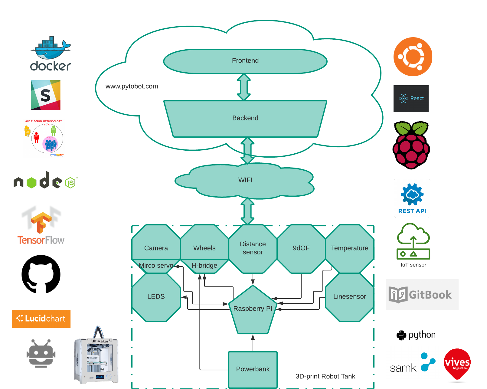

# Pytobot

## Intro

Pytobot is een DIY 3D-print low-cost Rover die je stap voor stap in wereld van IOT brengt.  
Het brengt electronica, 3D-modeling en ICT samen tot een project op maat van 10-16 jarigen.

Raspberry Pi kan nogal overwelding overkomen voor kinderen om mee aan de slag te gaan.   
Door middel van de Pytobot willen wij de stap kleiner maken en de raspberry pi toeganelijker maken om mee aan de slag te gaan. Met NodeRed wordt er een leeromgeving samengesteld dat adhv API's de robot aanstuurt. 

## What's Included

* Raspberry Pi Zero W
* Sparkfun 9DoF sensor 
* RGBW Digtial Led Strip
* RGBW Neopixel Ring
* Distance sensor
* Wide lens camera
* Micro Servo
* CYT1037 motor
* L298N H-Bridge motor controller
* QRE1113 Line Sensor 
* Easy control REST Interface
* * 

 

