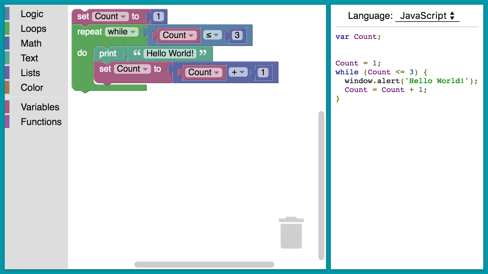
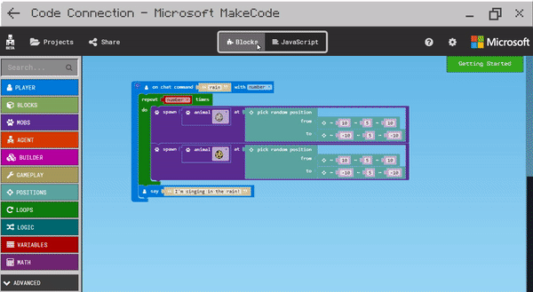

# Pytobot

## Intro

**Pytobot** is a DIY 3D-print **low-cost Rover** that will bring you step by step into the world of IOT.   
It takes electronics, 3D modeling and IOT together into a tailor-made **project for 10-16 year olds.**

Raspberry Pi can be quite overwhelming for children. With the Pytobot we want to make the step smaller and make the raspberry pi more **accessible for children**.   
With a full REST interface that controlls the bot, you will be able to have control on multiple ways for different levels of programming. 

## Communication and Control 

The Pytobot is build on a **REST interface**.   
What gives us the advantage that the Pytobot can be **controlled** from **any framework and program** thats connected to the network. 

## Education and purpose

The Pytobot is an Low cost & Easy control device. What makes programming and configuring the robot acceceble for everyone at every programming level. 

### NodeRed

**Node-RED** is a [flow-based](https://en.wikipedia.org/wiki/Flow-based_programming) development tool for [visual programming](https://en.wikipedia.org/wiki/Visual_programming_language) developed originally by [IBM](https://en.wikipedia.org/wiki/IBM) for wiring together hardware devices, [APIs](https://en.wikipedia.org/wiki/Application_programming_interface) and [online services](https://en.wikipedia.org/wiki/Online_services) as part of the [Internet of Things](https://en.wikipedia.org/wiki/Internet_of_Things).

###  Blockly

**Blockly** is a client-side [JavaScript](https://en.wikipedia.org/wiki/JavaScript) library for creating [visual block programming languages](https://en.wikipedia.org/w/index.php?title=Visual_block_programming_languages&action=edit&redlink=1) and editors. It is a project of [Google](https://en.wikipedia.org/wiki/Google) and is [open-source](https://en.wikipedia.org/wiki/Open-source) under the [Apache 2.0 License](https://en.wikipedia.org/wiki/Apache_2.0_License).[\[1\]](https://en.wikipedia.org/wiki/Blockly#cite_note-1) It typically runs in a web browser, and visually resembles [Scratch](https://en.wikipedia.org/wiki/Scratch_%28programming_language%29)

## Microsoft MakeCode

**Microsoft MakeCode** is a framework for creating domain-specific programming experiences for beginners.  
Microsoft MakeCode is based on the open source project [Microsoft Programming Experience Toolkit \(PXT\)](https://github.com/Microsoft/pxt):

## What's Included

### hardware

* Raspberry Pi Zero W
* [9DoF BNo055]() 
* RGBW Digtial Led Strip
* RGBW Neopixel Ring
* [Distance sensor](https://www.adafruit.com/product/164)
* Wide lens camera
* [Micro Servo](http://www.ee.ic.ac.uk/pcheung/teaching/DE1_EE/stores/sg90_datasheet.pdf)
* CYT1037 motor
* [L298N H-Bridge motor controller](https://www.sparkfun.com/datasheets/Robotics/L298_H_Bridge.pdf)
* [QRE1113 Line Sensor](https://www.sparkfun.com/products/9453)
* [PiOLED Adafruit](https://www.adafruit.com/product/3527)
* [switch](https://www.sparkfun.com/products/8837)

### Software

* REST Interface
* Docker
* Linux
* Github
* Gitbook
* Raspberry Pi
* Python
* Solidworks

