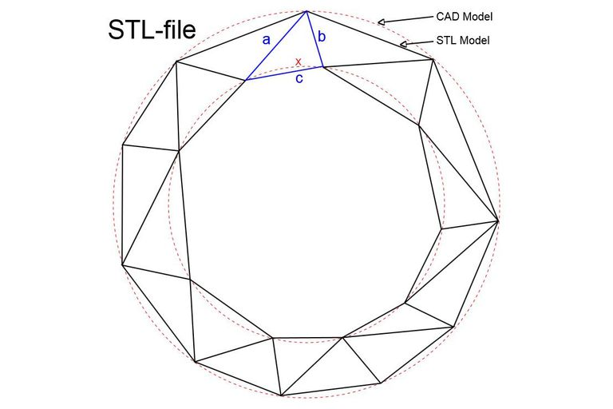

# Design


INSERT GIF OF 3D DESIGN


## About

3D printing is an innovative technology that lets you create a physical object from a digital model. It started in the 80’s under the name _‘rapid prototyping’_ because this was the purpose of the technology: to prototype faster and cheaper. A lot’s changed since then, and today 3D printers offer amazing results and let you create anything you can imagine.

> With 3D printing, complexity is free. The printer doesn't care if it makes the mos rudimentary shape or the most complex shape, and that is completely turning design and manufacturing on its head as we know it   
> _'Avi reichental' \(CEO of 3D Systems\)_

## Integration

3D printing is integrated in the project to have a direct output of the design.   
By using this technology in the project, the proccess of testing goes a lot quicker because of the easy changes that where possible to make in the design and the cheap and fast printing.

> The advantages of using 3D Printing is that you have the possibility proceed quickly in testing and updating the design to implement the new features or updates.

## **ST**ereo**L**ithography \(STL\)

The most common [3D printer](https://www.lifewire.com/3d-printers-ratings-2265) file format is the .STL file. The file format is believed to have been created by 3D Systems from its **ST**ereo**L**ithography CAD software and machines.

An easy-to-understand definition of the STL file format explains it as a triangular representation of a 3D object. A CAD drawing shows smooth lines for the circles, where an STL drawing shows the surface of that circle as a series of connected triangles.

## Download

| Name  | Download | Material | Quantity  |
| :--- | :--- | :--- | :--- |
| Top.stl | DOWNLOAD | ABS | 1 |
| Bottem.stm | DOWNLOAD | ABS | 1 |
| Wheel\_left.stl | DOWNLOAD | ABS | 2 |
| Wheel\_right.stl | DOWNLOAD | ABS | 2 |
| Tire.stl | DOWNLOAD | TPE | 4 |

## Print Version 1

### Remarks

While working with the first design it was possible to see the problems and where to improve the design

1. The Switch didn't fit in the provided space. The width needs to be 2mm more.
2. To have an easier way to assemble its better to provide a place for the screws head.
3. The battery holder has an extra mount that comes out. The model needs an extra hole right onder corner. 
4. Add a on/off LED when the switch is on. 
5. The top needs to be tighter
6. add a place to screw top and bottum 
7. Screws for the distance sensor
8. The holes for the motor gear can be smaller in the wall. 
9. Add holes for the PCB
10. Distance sensor needs to come further 

## Reference List

3D Printing- Ultimaker \[[SOURCE](https://ultimaker.com/en/explore/what-is-3d-printing)\]  
STL Files- Lifewire \[[SOURCE](https://www.lifewire.com/stl-files-2255)\]

