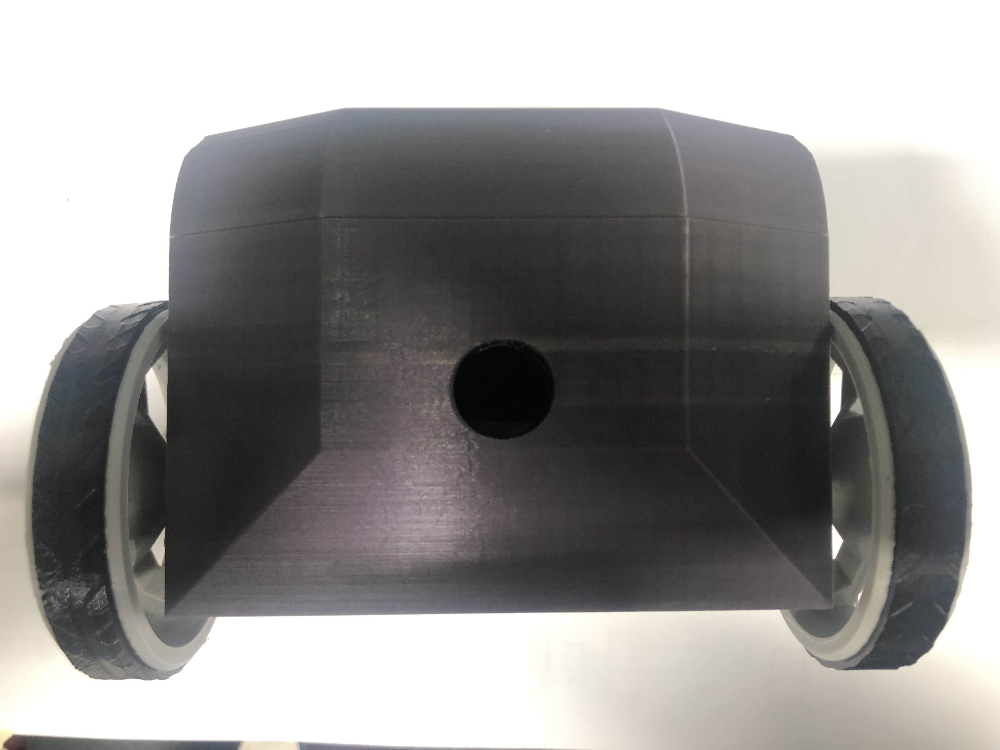
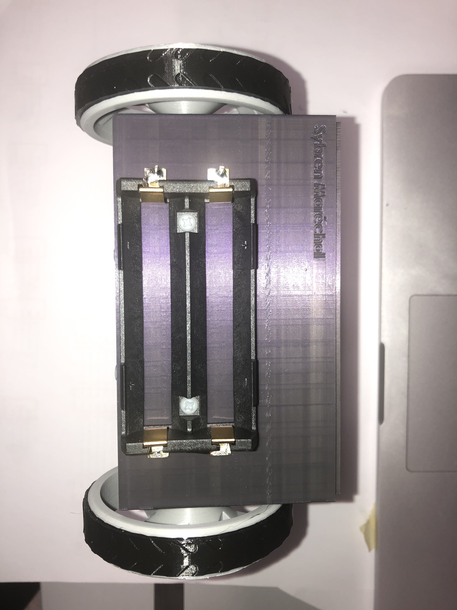
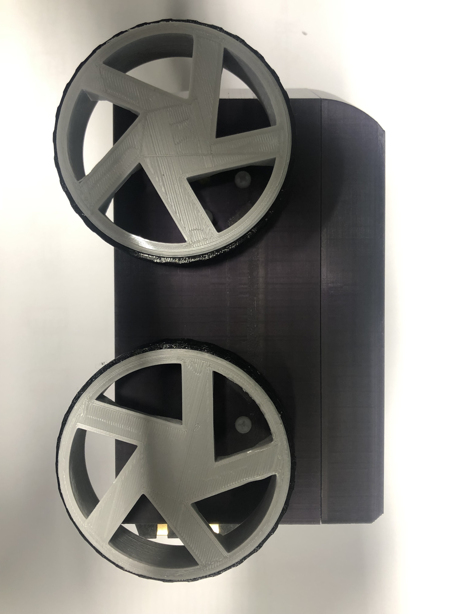
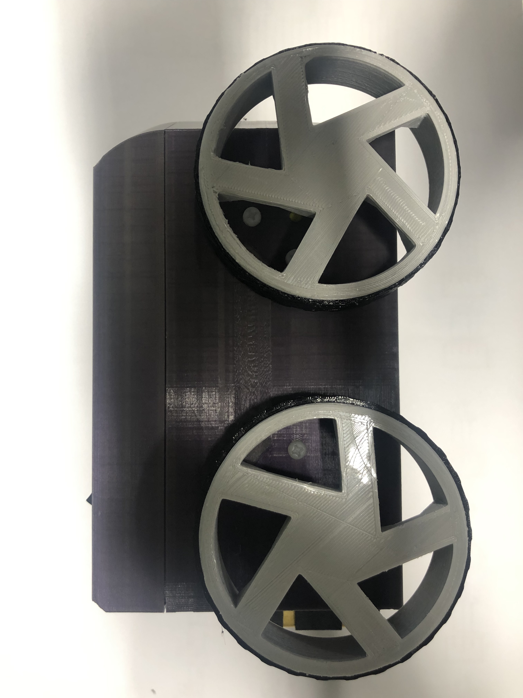
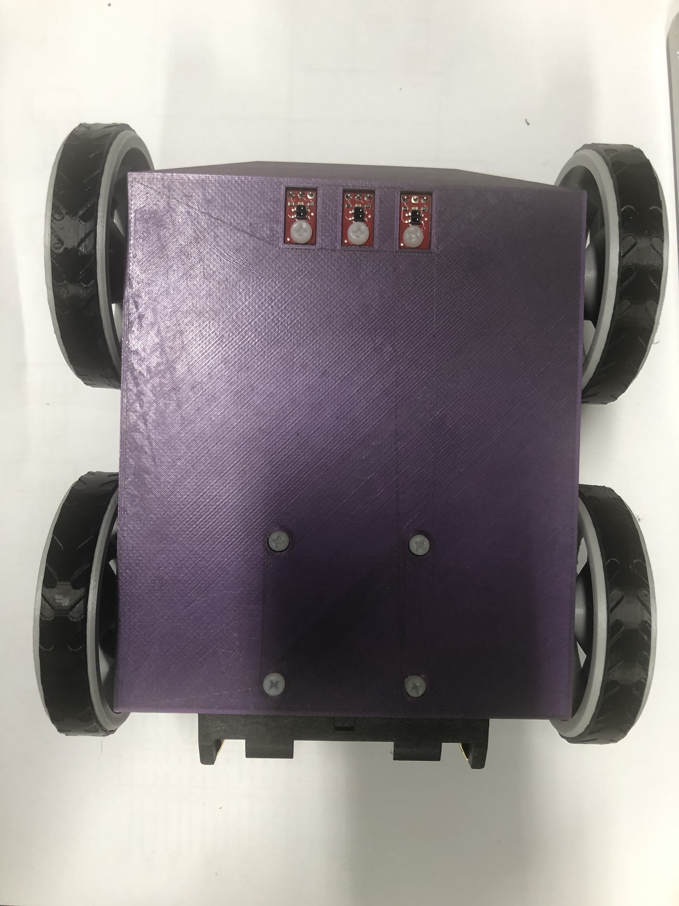
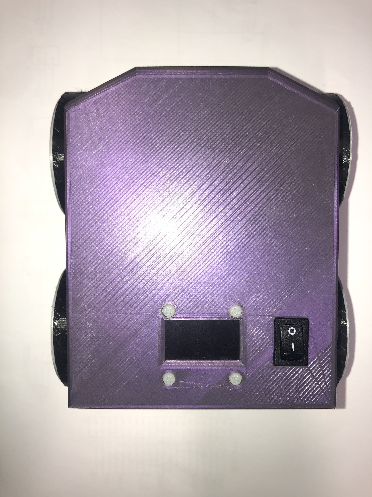

# Design V1.0.0

## Integration

The first design is designed to have an _all fit_ _model_. To have a small box where all the hardware is together for testing and driving the robot. 

<table>
  <thead>
    <tr>
      <th style="text-align:left">Position</th>
      <th style="text-align:left">Picture</th>
    </tr>
  </thead>
  <tbody>
    <tr>
      <td style="text-align:left">Front</td>
      <td style="text-align:left">
        

        

          
        

      </td>
    </tr>
    <tr>
      <td style="text-align:left">Back</td>
      <td style="text-align:left">
        

        

          
        

      </td>
    </tr>
    <tr>
      <td style="text-align:left">Left</td>
      <td style="text-align:left">
        

        

          
        

      </td>
    </tr>
    <tr>
      <td style="text-align:left">Right</td>
      <td style="text-align:left">
        

        

          
        

      </td>
    </tr>
    <tr>
      <td style="text-align:left">Bottom</td>
      <td style="text-align:left">
        

        

          
        

      </td>
    </tr>
    <tr>
      <td style="text-align:left">Top</td>
      <td style="text-align:left">
        

        

          
        

      </td>
    </tr>
  </tbody>
</table>## Remarks

While working with the first design it was possible to see the problemns and where to improve the design

1. The Switch didn't fit in the provided space. The widht needs to be 2mm more.
2. To have an easier way to montage its better to provide a place for the screws head.
3. The battery Holder has an extra mount that coms out. The model needs an extra hole right onder corner. 
4. Add an on light when the switch is on. 
5. The top needs to be tighter
6. add an place to screw top and bottum 
7. Screws for the Distance sensor
8. The holes for the motor gear can be smaller in the wall. 
9. Add holes for the PCB

