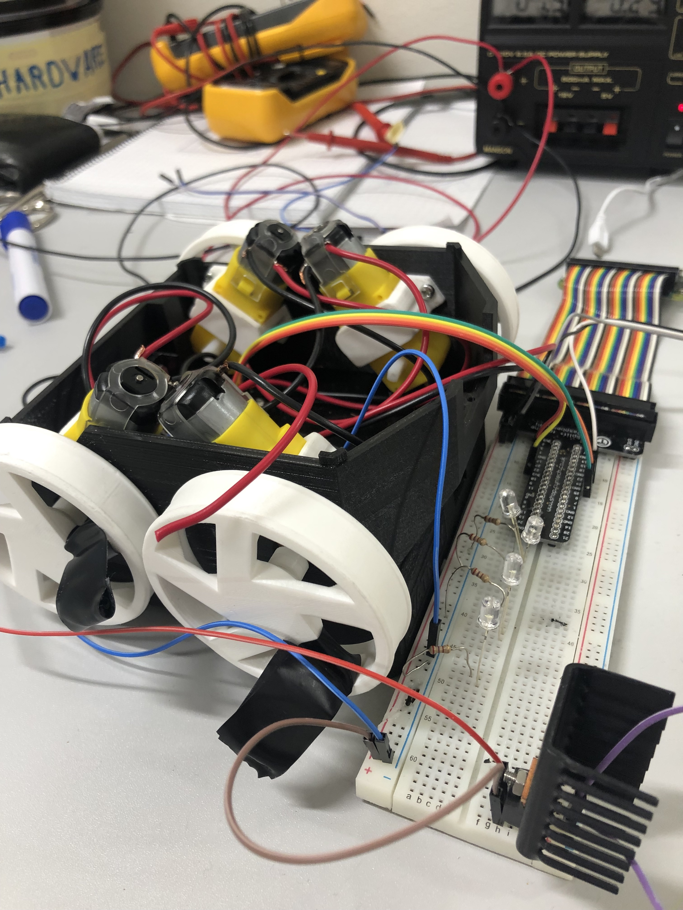
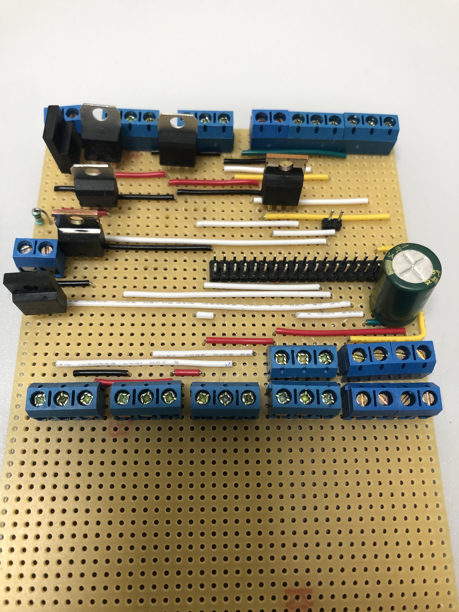

# Circuit Board

## Circuit Board

A **printed circuit board** \(**PCB**\) mechanically supports all of the electronic components.

## Version 0.1

The first prototype is made on a **breadboard**. In the first prototype is the main functionality to power the devices. The input power is 7.2V because later in the project the power source will change from an Voltage Regulator to 2X 3.6V battery's. This input power is used to power the H-bridge that controls the motors. 

The DC-DC converter is used to regulate the battery input to 5V to power on the raspberry Pi.


While using the Breadboard there was an **0.2 voltage drop** through the circuit. Breadboards are good for testing. But if you want a steady design. Soldering is the solution. 


## Version 0.2

The **second version** of the print was **soldered** to get rid of the voltage drop through the circuit and have a more steady design. Screw terminals where added  to have a more easy connection with the hardware. Because the DC-DC regulator can't take more than 1A and the LED's take more than 1A. 2 extra DC-DC regulators were added for 2 extra LED strips. Also an diod is added to the circuit to secuire the devices if the battery's would not placed correctly and pot power on the ground. The condensator was added to have a more stady circuit for the raspberry pi

> Version 0.2 is the first design that was used with battery power to have the first tests of the motors and remote control

## Version 0.3

In the 3th design, **heat sinks** were added. Because the voltage regulation creates a lot of heat and couldn't handle the heat for a long time. Also new screw terminals were added to control the H-Bridge, Motors, LED's, Line Sensor's, Distance Sensor, Oled & 9DoF. 

On the print all the connections from the Raspberry Pi were connected by extra jumpers. This was done to have a possibility to quickly chanche IO Pins and test different situations. 

## Version 0.4

After Version 0.3 the **power** on/off **switch** was added. To be able to **shut down** the Raspberry Pi in a safe way. In version 0.4 tests where done to see how to handle the heat without using heat sinks. Because heat sinks take a lot of extra space. 

## Version 1.0 PCB

After testing the first 5 designs the **PCB** came into place. the design of this pcb was made to fit in the robot and has all the functionalities to test all of the senors and. To fit all of the screw terminals on the print, smaller screw terminal was used with a wide of 3.5mm. Also the raspberry pi is integraded as an add-on to the print.

### Improvements

While Testing the first 1.0 PCB some minor and major issues came up. 

1. Make use of smaller via's
2. Make the screw hole's from the Raspberry Pi zero to 2.5mm.
3. Change distance sensor on pin RX
4. Lower the electronics, so the camera cable can fit in the raspberry Pi
5. Change the motor circuit to the raspberry Pi circuit. Do not need Q3 anymore
6. IC1 higher because the fet comes out of the pcb
7. Change some io's to have less via's.
8. Change the value of the resistors
9. Add positve and negative side at the capacitor sign
10. Change the value of the capacitors
11. change the 2 pin screw connectors to the right size
12. change the diode to smaller one
13. add names for the wires
14. 
