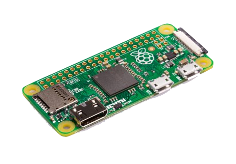

# Controller

##  Raspberry Pi Zero W

### About

The **Raspberry Pi** is a small **credit-card-sized computer**.With the addition of wireless LAN and Bluetooth, the Raspberry Pi Zero W is ideal for making embedded **Internet of Things \(IoT\)** projects. The Pi Zero W has been designed to be as flexible and compact as possible with mini connectors and an unpopulated **40-pin GPIO**, allowing you to use only what an project requires



## Integration

The raspberry PI zero W is used because of the small size and the many IO Pins, techonology's as Ic2 and SPI busses. Also a big adventage of the Zero W is the **Wireless connectivity**. By using the wireless connectivity the raspberry Pi can host his own netwerk an functions as a router. 

The biggest advantage of the raspberry Pi is the system. The raspberry Pi is an **Linux** based device. For this project, ****[**Raspbian Stretch Lite 2019-04-08**](https://www.raspberrypi.org/downloads/raspbian/) is used as operating system.  
Raspbian Lite is the "clean install" of Raspbian. 


Raspbian is a [Debian](https://en.wikipedia.org/wiki/Debian)-based OS for Raspberry PI.


## Control

The rapsberry Pi is programmed as a **router**. When the raspberry Pi wakes up, a network will go up. And the SSID name and PASSWORD will be put out on the Oled Screen.   
When connected to the network. The raspberry pi is acceible by 

```text
ssh pi@192.168.4.1
```

now you're logged into the robot. And you can start to control and program.

## Troubleshoot


Make sure that your home network is an other network than **192.168.4.0/24**


If your home network is in the same range you can change the network in the [Local Hotspot](https://docs.pytobot.com/programming/setup/local-hotspot) configuration.

## Reference List

Raspberry Pi Zero- Raspberry Pi \[[SOURCE](https://www.raspberrypi.org/products/raspberry-pi-zero-w/)\]  
Raspbian- Raspberry Pi \[[SOURCE](https://www.raspberrypi.org/downloads/)\]

  


