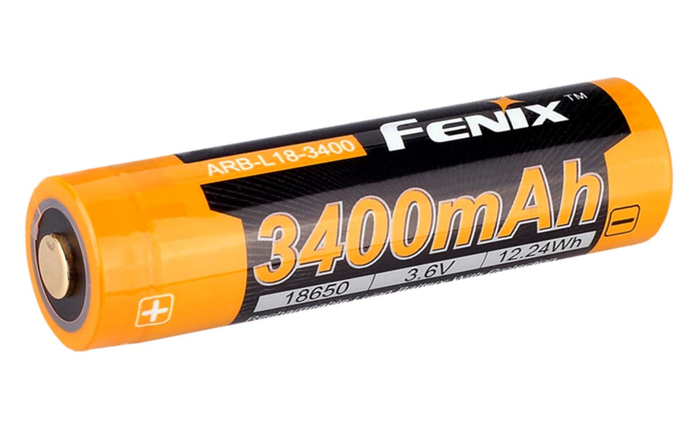
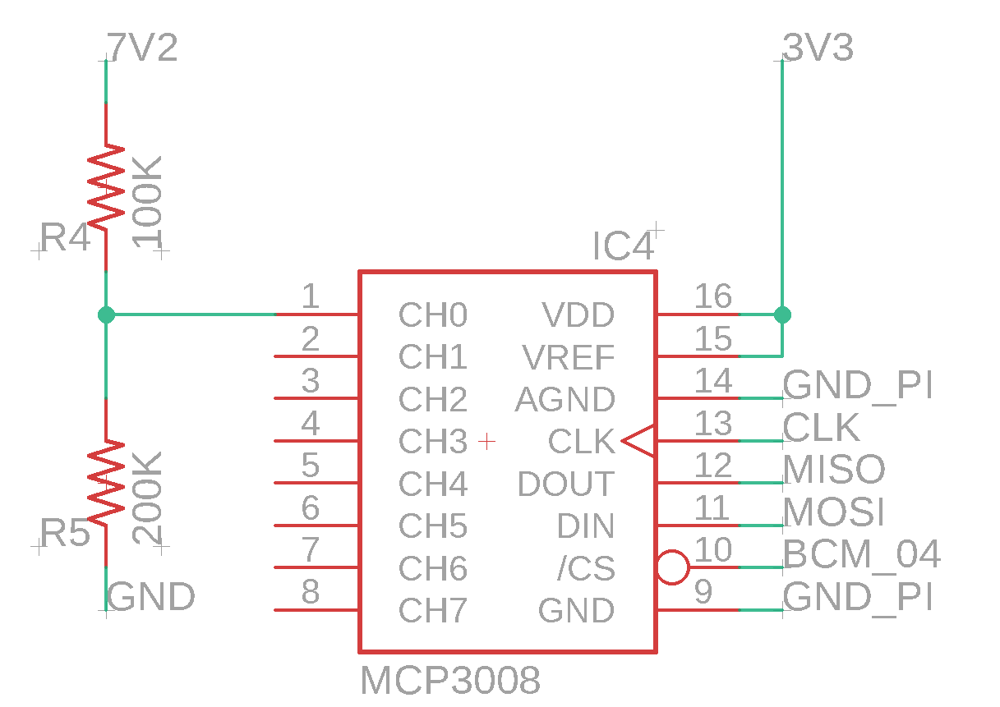
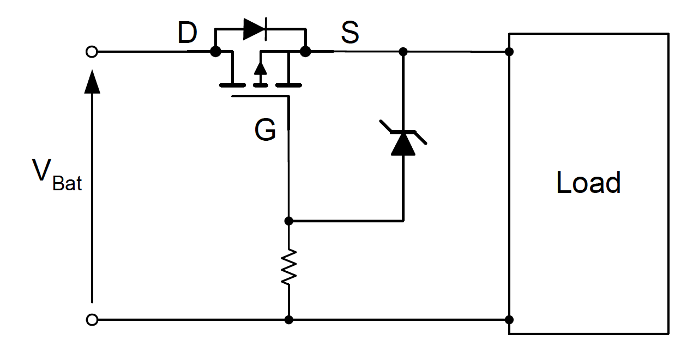

# Battery input

## FENIX ARB-L18-3400 RECHARGEABLE 18650 BATTERY

The Fenix ARB-L18-3400 is a **high capacity** 18650 Li-ion **rechargeable** with a protection circuit in the anode to help **prevent short circuits**, **over charge/discharge** and **over heating**. The battery also includes pressure relief vents which expel waste gas in the rare case of an internal short circuit preventing an explosion.

## **Integration in the project.**

To use the Motors an 6-12V input is required. For this project and max speed of the motors 2X 3.6V batteries are used, what gives an 7.2V input voltage with 3400mAh.

The Fenix ARB-L18-3400 Where used in this project because of the inter technology.  
Prototyping With Battery Input can be dangerous and you can easily kill an Li-on Battery,  
So to be able to work in the safest conditions this battery is used because of his intern security technology


On full power the robot batteries can last for approximately 45 minutes


## Battery Voltage

To be able to secure the components and the controller. A voltage detection is needed to shut down the circuit when the batteries drop below the minimum voltage.


The Raspberry Pi doesn’t have _\*\*_a way to read analog inputs. It's a digital-only device.


To solve the problem of only analogue in. An ADC is an added to convert analog to digital.

### Voltage Divider

A voltage divider circuit is a very common circuit that takes a higher voltage and converts it to a lower one by using a pair of resistors. The formula for calculating the output voltage is based on Ohms Law and is shown below.

$$
Vout = \frac{Vs*R5}{R4+R5}
$$

$$
5V ≈ \frac{7V2*150K}{100K+150K}
$$

### Code

The following code shut down the Raspberry Pi when the voltage goes under 5V.

## Polarity Protection

To **prevent** the circuit against **inverted polarity** by switching the input voltage or the battery's. A **P-channel** mosfet is used to secure the circuit.

The huge **benefit** by using a p-channel MOSFET belongs to the fact, that **no additional high side driver circuit is needed**. Compared to a n-channel MOSFET the device will be turned on by applying a negative Gate Source voltage. By referring the Gate signal to the ground line, the device is fully turned on when the battery is applied in the right polarity.

**By reverse polarity**, the MOSFET will be **switched off**, because the Gate Source voltage in this case will be positive.

## References

Polarity Protection- Marco Pürschel\(14/01/09\)\[[SOURCE](https://www.infineon.com/dgdl/Reverse-Batery-Protection-Rev2.pdf?fileId=db3a304412b407950112b41887722615)\]

