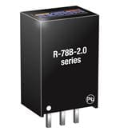
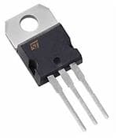

# Voltage regulation

## R-78B05

The R-78Bxx-2.0 series is a high efficiency switching regulator. The efficiency up to 96% means that very little energy is wasted as heat. Full power is available over a temperature range of -40°C up to 70°C without the need for heat sinks with their additional space and mounting costs.


The R-78Bxx-1.0 series high efficiency switching regulators are ideally suited to replace 78xx linear regulators and are pin compatible.


## Usage

The input voltage of the batteries\(7.2V\) is used to power the H-bridge and the Motors.  
To use the controller and sensors, a 5V input is needed. So a step down to 5V is necessary.


The Ampere use of the LED's is variable from a lot of different factors. Because the variance is so high, a separate 2A circuit is needed. 


### LED strip

The LED strip approximately uses more that 2A for the 72 LED's. To devide the current 2 voltage deviders are used to power the LED. 

## Troubleshooting

### AN7805

At first the **AN7805 DC DC step down** was used to have a 5V regulator that has the possibility to regulate until 1A. But the efficiency was much lower and there was a lot of energy going into heat. So a heat sink is needed to use the AN7805.   


The big difference between AN7805 and the R-78B05 is the big price difference and the efficiency.


## Datasheet



