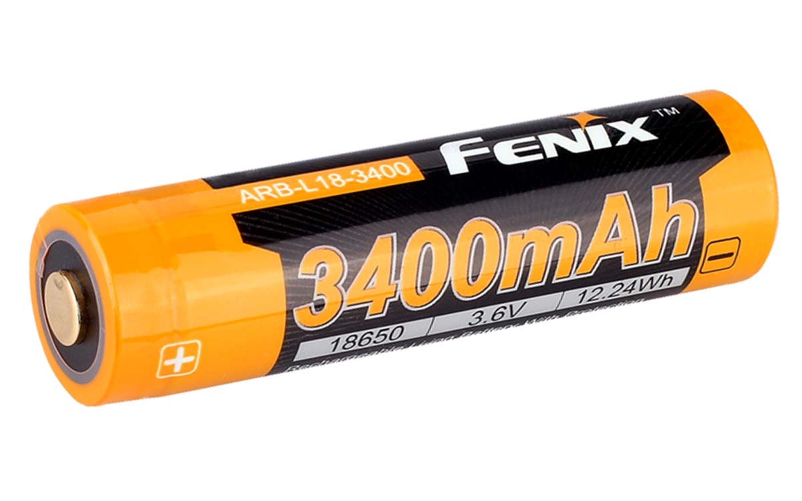
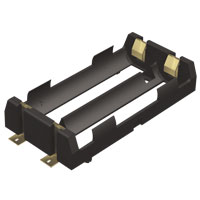
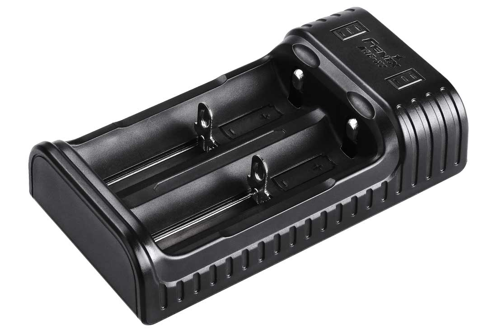

# Battery

## FENIX ARB-L18-3400 RECHARGEABLE 18650 BATTERY

### specifications

* ARB-L18-3400 Rechargeable Battery
* 3400mAh high capacity
* Protection circuitry to prevent short circuits
* Pressure vents to prevent explosions
* 500 charge cycles
* Voltage: 3.6V
* Charging Current: Recommended 1A, maximum 2A
* Weight: 1.8 ounces \(50g\)
* Size: Length: 2.7″ \(69mm\) Diameter: 0.7″ \(18.6mm\)
* Warranty Period: 12 month from date of purchase

<table>
  <thead>
    <tr>
      <th style="text-align:left"></th>
      <th style="text-align:left"></th>
    </tr>
  </thead>
  <tbody>
    <tr>
      <td style="text-align:left"><b>SMT Polarized Holder for Dual 18650 Batteries P/N 1048</b>
      </td>
      <td style="text-align:left"></td>
    </tr>
    <tr>
      <td style="text-align:left">
        

        <ul>
          <li><b>Cells:</b> 2</li>
          <li><b>Cell Size:</b> 18650</li>
          <li><b>Material:</b> Nylon- High Temp UL 94 V-0</li>
          <li><b>Mounting:</b> Surface Mount</li>
          <li><b>Type:</b> Holder</li>
        </ul>
        

      </td>
      <td style="text-align:left">
        

        

          
        

      </td>
    </tr>
    <tr>
      <td style="text-align:left"><b>FENIX ARE-X2 BATTERY CHARGER</b>
      </td>
      <td style="text-align:left"></td>
    </tr>
    <tr>
      <td style="text-align:left">
        
<b>Size:</b>
           Length: 4.5&#x201D; (115mm)
           Width: 2.5&#x2033; (63mm)
           Height: 1.2&#x201D; (30mm)

        
<b>Weight:</b> 3.4 oz. (96g) excluding cable

        
<b>Battery Compatability:</b>
           <em>Li-ion batteries: </em>10440, 14500, 16340, 18650, 26650
           <em>Ni-MH or Ni-Cd batteries: </em>AA, AAA

        
<b>Input:</b> DC 5V, 1.5A (Max)
           <b>Output:</b> 5V, 1.5A: 18650, 26650 5V, 1.0A: 16340, 14500, 10440

        
<b>Warranty:</b> Limited Lifetime Guarantee from Fenix Lighting U.S.

      </td>
      <td style="text-align:left">
        

        

          
        

      </td>
    </tr>
  </tbody>
</table>## **Integration in the project.**

### Input voltage

For the project we use 2x 3.6V 3400mA batterys. 



