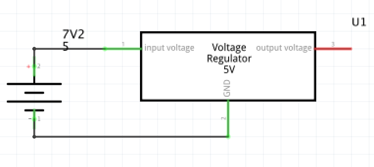

# DC DC converter

The AN78xx series and the AN78xxF series are 3-pin, fixed positive output type monolithic voltage regu- lators. Stabilised fixed output voltage is obtained from unstable DC input voltage without using any external components.

## Usages

From the 7.2V input Battery we need to step down to 5V for the following controller and sensors: 

* Raspberry Pi
* Line Sensor 1 
* Line Sensor 2
* Line Sensor 3
* Camera Servo
* Camera
* Oled
* 9Dof
* Distance Sensor
* Led 1
* Led 2 



