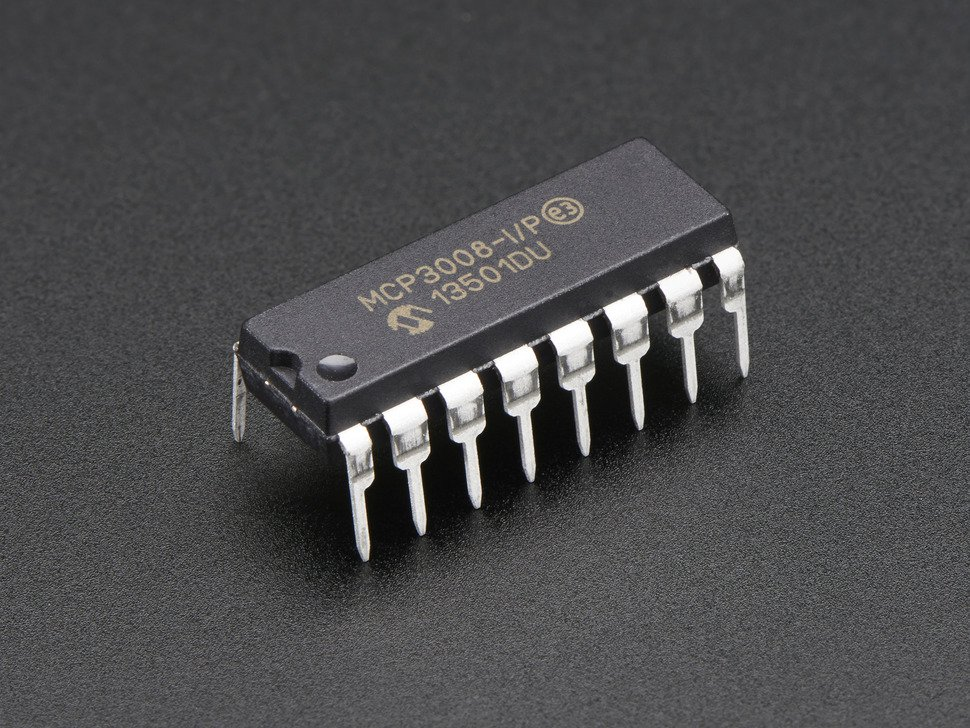

# Power management

### **ADC**

The Raspberry Pi computer does not have a way to read analog inputs. It's a digital-only computer. Compare this to the Arduino, AVR or PIC microcontrollers that often have 6 or more analog inputs! Analog inputs are handy because many sensors are analog outputs, so we need a way to make the Pi analog-friendly.

\*\*\*\*[**https://github.com/aboudou/picheckvoltage**](https://github.com/aboudou/picheckvoltage)\*\*\*\*

