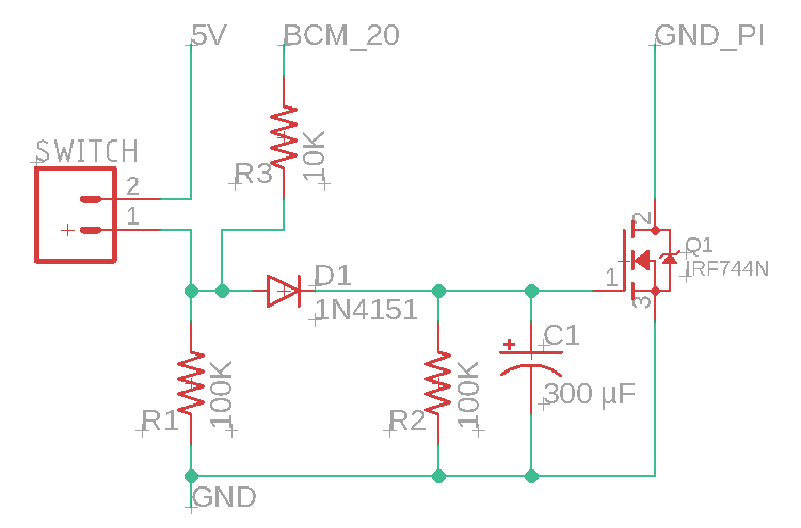
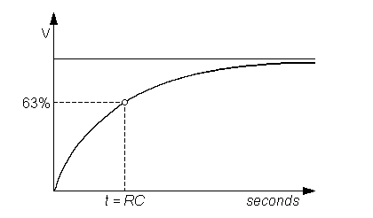
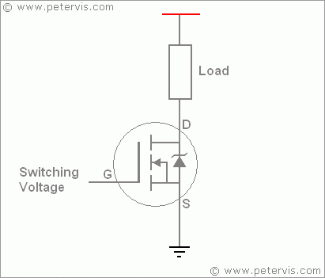

# Kill switch

## Kill Switch

The raspberry Pi needs a proper shutdown before the power goes of, otherwhise your SD card can be curropted. To shutdown the Raspberry Pi the command `sudo shutdown now` must be executed.


If the raspberry Pi isnt shutdown propperly you can corrupt the SD card!


## Circuit

#### When SWITCH =&gt; ON

The 5V from the DC reguator will go through D1 and will power the Gate of Q1.  
While putting Q1 High C1 will start charging. And BCM\_20 of the Raspberry Pi will go up.



#### When SWITCH =&gt; OFF 

The remaining Votage before D1 will drain through R1 to the ground.   
So BCM\_20 will become LOW. And the following code will run.

```python
 if not GPIO.input(20):
        print('SYSTEM SHUTDOWN')
        call("sudo shutdown -h now", shell=True)
```

C1 will Load off his voltage to the Raspberry Pi, so that the Raspberry Pi has enough time to execute the command and shut down propperly 

### RC Time Constant 




Time constant is a measurement of the time needed to charge or discharge a capacitor by ~63.2% of the differenece between the old value and new value after an impulse that induces a change has been applied.


$$
t(s) = R(π) * C(F) = 10 000* 3,3 =  33 seconds
$$

Where τ is measured in seconds, R in Ohms and C in Farads.

## IRFZ44N

**IRFZ44N** belongs to the family of  N-channel Power [MOSFETs](https://www.theengineeringprojects.com/2018/02/introduction-to-mosfet.html), covered in plasteic body and uses **“Trench”** technology. Its features include very low on state resistance, high speed processing technology, completely avalanche rated etc. Push pull systems and full bridge are few of its real life applications.

IRF-Z44N has a few major features. For this project the IRFZ44N is used for his **Fast switching capability and ultra low charge on the gate**



## Datascheet



## References

Electronic Components- Syed Zain Nasir\(9/10/17\)\[[SOURCE](https://www.theengineeringprojects.com/2017/09/introduction-to-irfz44n.html)\]

