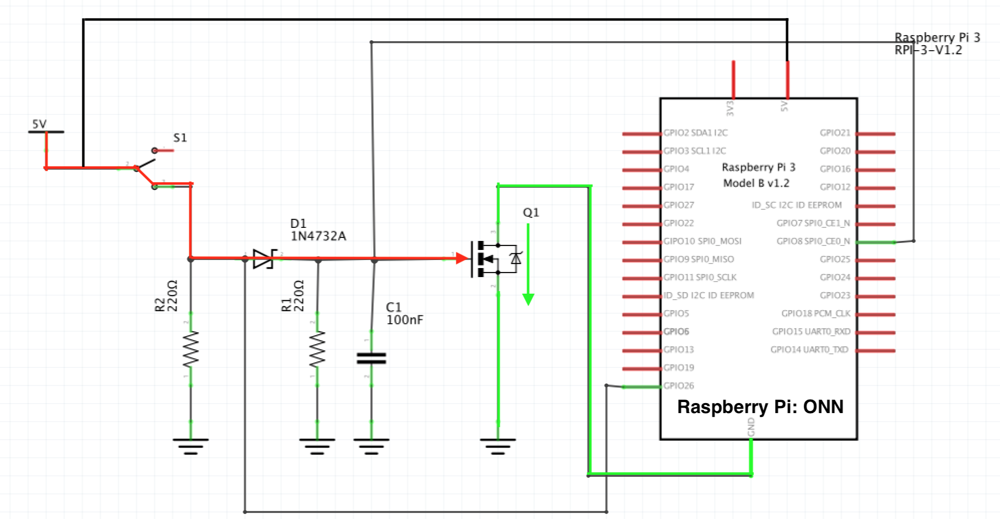
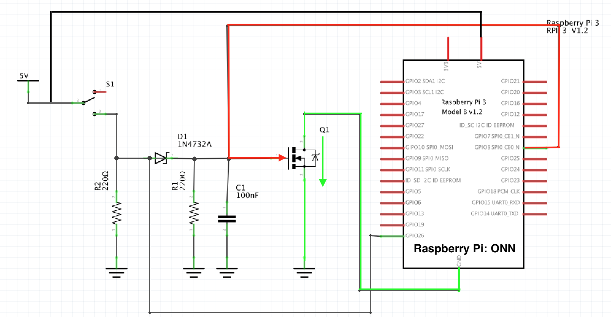
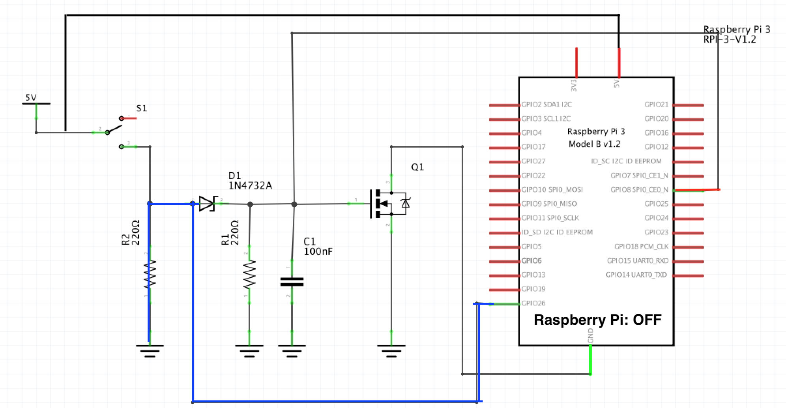

# Kill switch

## Kill Switch

Before shutting down the circuit the raspberry Pi must go in shutdown. 


If the raspberry Pi isnt shutdown propperly you can corrupt the SD card!


To give the raspberry Pi an proper shutdown 

#### When S1 =&gt; '1'

5V will go thrue the Diode and gives 5V to the Gate of the mosfet.   
The current will flew from the Source to the Drain. and the raspberry Pi will activite.

When the Raspberry Pi is up pin 08 will go UP.   
Pin 26 will recieve 5V.

#### When S2 =&gt; '0'

current will flow thrue R2 and pin 26 will recieve 0V.   
`When 26 == Down   
  {  
  sudo shutdown now   
  }`

Raspberry Pi will shutdown but to be shure that pin 8 stays high C1 will give the raspberry the power to have enoufh time to properly Shutdown. When the raspberry Pi is shutdown. Pin 8 will go Flyng state and the current will drain thrue R1. The system is back to default mode. 

## IRFZ44N

  
The IRFZ44N is an _n-channel_ enhancement mode power MOSFET manufactured by International Rectifier Corporation, in a TO-220 package. It has a continuous drain current of 49 A at 25 °C, and 35 A at 100 °C, making it an ideal component for switched mode power supplies, and general switching applications. This MOSFET has an operating temperature of 175 °C and therefore a heatsink is vital.

