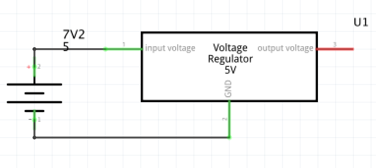

# DC DC converter

**PICTURE R78B5**

## R-78B5

The R-78Bxx-2.0 series high efficiency switching regulators are ideally suited to replace 78xx linear regulators and are pin compatible. The efficiency of up to 96% means that very little energy is wasted as heat. Full power is available over a temperature range of -40°C up to 70°C without the need for heatsinks with their additional space and mounting costs. A high input voltage of up to 32VDC and output voltages from 1.2V up to 15V, low ripple and noise figures and a short circuit input current of typically only 50mA round off the specifications of this versatile converter series.

## Usage

From the 7.2V input Battery we need to step down to 5V for the following controller and sensors: 

* Raspberry Pi
* Line Sensor 1 
* Line Sensor 2
* Line Sensor 3
* Camera Servo
* Camera
* Oled
* 9Dof
* Distance Sensor
* Led 1
* Led 2 

## Trouble shooting

### AN7805

At first the **AN7805 DC DC step down** was used to have an 5V regulator that has the possebilty to regulate until 1A. By further measurements came the conclution that the devices takes to much current to control the output without using an Heat Sink 

> _AN7805 has a low efficient and loses a lot with Heat._

The AN78xx series and the AN78xxF series are 3-pin, fixed positive output type monolithic voltage  
 regulators. Stabilised fixed output voltage is obtained from unstable DC input voltage without using any external components.


Needs Heat Sink


