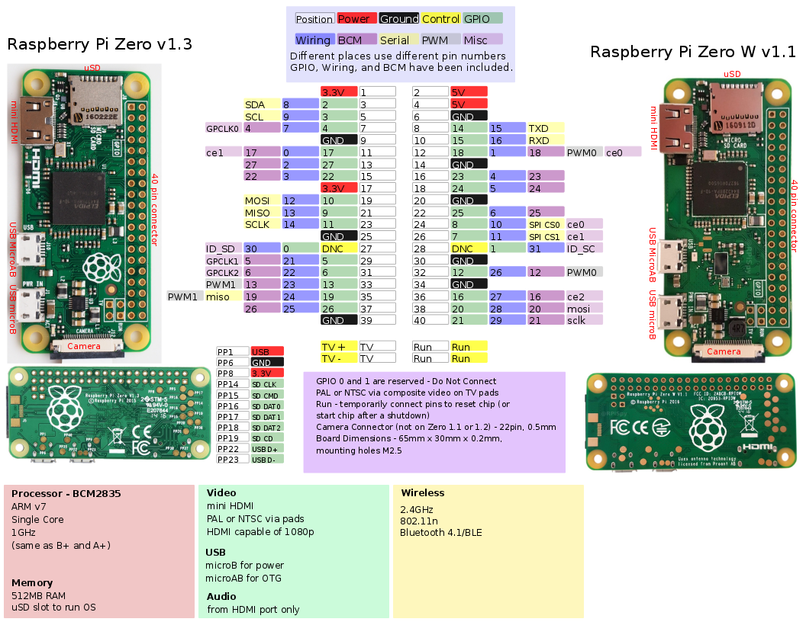

# Controller

##  Raspberry Pi Zero W

### 

### About

The credit-card-sized computer has become even smaller! The Raspberry Pi Zero W is still the Pi you know and love, but at a largely reduced size of only 65mm long by 30mm wide and at a very economical price. With the addition of wireless LAN and Bluetooth, the Raspberry Pi Zero W is ideal for making embedded Internet of Things \(IoT\) projects. The Pi Zero W has been designed to be as flexible and compact as possible with mini connectors and an unpopulated 40-pin GPIO, allowing you to use only what your project requires.

At the heart of the Raspberry Pi Zero W is a 1GHz BCM2835 single-core processor, the same as the B+ and A+, with 512MB RAM. Quite frankly, this Pi is about four times faster that the original Raspberry Pi and is only a fraction of the cost of the current RPi3.

### Specs

* 802.11 b/g/n wireless LAN
* Bluetooth\(R\) 4.1
* Bluetooth Low Energy \(BLE\)
* 1GHz, single-core CPU
* 512MB RAM
* Mini HDMI and USB On-The-Go ports
* Micro USB power
* HAT-compatible 40-pin header pins
* Composite video and reset headers
* CSI camera connector
* 
## Integration

The Raspberry Pi is the brain of the Pytobot. 

