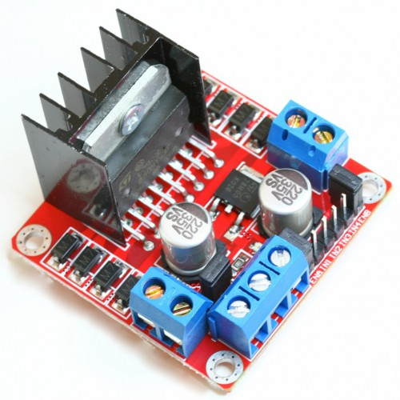

# Motor

## Motor

The Motor Shield is based on the L298, which is a dual full-bridge driver designed to drive inductive loads. It drives two DC motors , controlling the speed and direction of each one independently by PWM.

## Integration

the Motor circuit is build 

