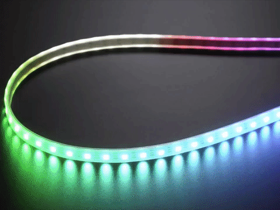

# LED-Strip

## Adafruit Digital RGBW Led Strip




* 144 LEDs per meter
* Maximum 5V @ 60mA draw per LED \(all LEDs on full brightness\)
* 5VDC power requirement \(do not exceed 6VDC\) - no polarity protection!
* 1 integrated RGB LEDs per segment, individually controllable
* LED wavelengths: 630nm/530nm/475nm
* Connector: [3-pin JST SM](http://www.jst-mfg.com/product/detail_e.php?series=238)
* Strip Width: 15mm / 0.6"
* Strip Thickness: 4mm / 0.16"
* Weight: 35.42g
* [WS2812 Datasheet](https://cdn-shop.adafruit.com/datasheets/WS2812.pdf)
* [SK6812 Datasheet](https://www.adafruit.com/images/product-files/1138/SK6812%20LED%20datasheet%20.pdf)
* May ship with either WS2812B or SK6812-based LEDs. They are the same brightness, color and protocol

## Integration

The Neopixels are implemented in the car to have an easy and quick respons.

## Calculation

| Emitting color | Wavelength\(nm\) | Luminous intensity\(mcd\) | Current\(mA\) | Voltage\(V\) |
| :--- | :--- | :--- | :--- | :--- |
| Red | 620-630 | 550-700 | 20 | 1.8-2.2 |
| Green | 515-530 | 1100-1400 | 20 | 3.0-3.2 |
| Blue | 465-475 | 200-400 | 20 | 3.2-3.4 |


The max rating is assuming all the LEDs are on full white, usually the actual current for colorful design is about 1/3 to 1/2 the max current.


$$
24*(20+20+20)=1440mA
$$

$$
1440mA/2=720mA
$$

  


## Code

```python
import board
import neopixel

pixel_pin = board.D18
num_pixels = 10
ORDER = neopixel.RGB

pixels = neopixel.NeoPixel(pixel_pin, num_pixels, brightness=0.2, auto_write=True,
                           pixel_order=ORDER)
while True:
   pixels.fill((255, 255, 255)) ##White
   time.sleep(1)
```

## Currilicum

## Datasheets


