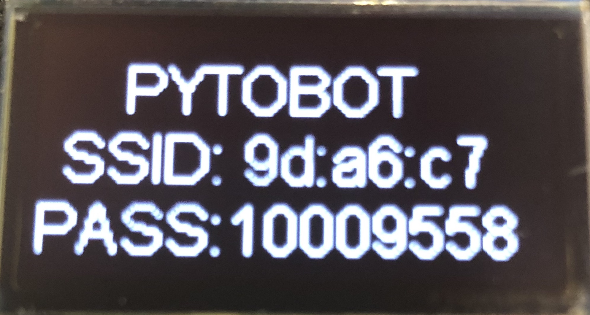
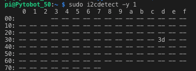

# OLED

## 


## About

Adafruit Industries LLC

These displays are small, only 1.3" diagonal, but very readable due to the high contrast of an OLED display. This display is made of 128 x 64 individual white OLED pixels, each one is turned on or off by the controller chip. Because the display makes its own light, no backlight is required. This reduces the power required to run the OLED and is why the display has such high contrast. The driver chip, SSD1306 can communicate in two ways: I²C or SPI. The OLED itself require a 3.3V power supply and 3.3V logic levels for communication, it includes a 3.3V regulator and all pins are fully level shifted so you can use with 5V devices. The power requirements depend a little on how much of the display is lit but on average the display uses about 40mA from the 3.3V supply. Built into the OLED driver is a simple switch-cap charge pump that turns 3.3V – 5V into a high voltage drive for the OLEDs.

## Specs

Breakout Board Dimensions:

* PCB: 35mm x 35mm x 5mm / 1.4" x 1.4" x 0.2"
* Mounting Hole Dimensions: 29.5mm x 29mm / 1.16" x 1.14"
* Mounting Hole Diameter: 2.5mm / 0.1"
* Screen: 23mm x 35mm / 0.9" x 1.4"
* Weight: 8.5g
* This board/chip uses I2C 7-bit address between 0x3C-0x3D, selectable with jumpers

OLED Display Details:

* Diagonal Screen Size：1.30"
* Number of Pixels：128 × 64
* Color Depth：Monochrome \(White\)
* Module Construction：COG
* Module Size \(mm\)：34.50 x 35.00
* Panel Size \(mm\)：34.50 x 23.00 x 1.45
* Active Area \(mm\)：29.420 x 14.70
* Pixel Pitch \(mm\)：0.23 x 0.23
* Pixel Size \(mm\)：0.21 x 0.21
* Weight \(g\)：2.18
* Duty：1/64
* Brightness \( cd/m2\)：100 \(Typ\) @ 12V
* Display current draw is completely dependent on your usage: each OLED LED draws current when on so the more pixels you have lit, the more current is used. They tend to draw ~25mA or so in practice but for precise numbers you must measure the current in your usage circuit.

## Integration

The Oled is used to read the SSID and PASSWD of the local network from the rapsberry Pi. 

## Code

```python
def Print(self):
        self.mac = "ifconfig eth0 | grep -Eo ..\(\:..\){5} | tail -c 9"
        self.MAC = subprocess.check_output(self.mac, shell=True).decode("utf-8")
        self.passwd = "grep wpa_passphrase /etc/hostapd/hostapd.conf | tail -c 9"
        self.PASSWD = subprocess.check_output(self.passwd, shell=True).decode("utf-8")

        self.draw.text((self.x, self.top+10), "PYTOBOT \n" +"SSID: " + self.MAC + "PASS:" + self.PASSWD, font=self.font, fill=255, align="center")

```



## Troubleshooting 

### Scrambled Screen


It's the pin for the RESET line. In transferring from library to my working code, I omitted to re-edit the definition of the reset pin. If it's not working, check that RST is wired to the correct pin, and that it is set for output. The reset is necessary for both the SPI and and I2C versions with the Adafruit library. \[[SOURCE](http://engineeringnotes.blogspot.com/2015/03/why-is-oled-display-scrambled-random.html)\]

#### Adding hardware reset pin

If you have a reset pin \(which may be required if your OLED does not have an auto-reset chip like the FeatherWing\) also pass in a reset pin like so:

```python
import digitalio
import board
 
reset_pin = digitalio.DigitalInOut(board.D4) # any pin!
oled = adafruit_ssd1306.SSD1306_I2C(128, 32, i2c, reset=reset_pin)
```




### No I2C Device


ValueError: No I2C device at address: 3d


**`sudo i2cdetect -y 1`**

You should see the following, indicating that address **0x3d** \(the OLED display\) was found





```text
disp = adafruit_ssd1306.SSD1306_I2C(128, 64, i2c, addr=0x3d)
```




Change the address: "**addr=0x3d**" to the addres what whas found in the _I2Cdetect_


## Datasheet



