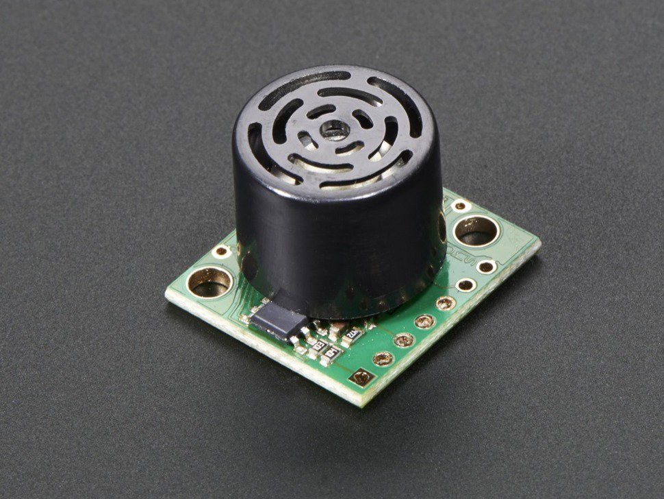

# Distance Sensor

## Distance sensor



LV-EZ1 Maxbotix Ultrasonic Rangefinder provides very short to long-range detection and ranging, in an incredibly small package. It can detect objects from 0-inches to 254-inches \(6.45-meters\) and provides sonar range information from 6-inches out to 254-inches with 1-inch resolution. \(Objects from 0 inches to 6-inches range as 6-inches.\) The interface output formats included are pulse width output \(PWM\), analog voltage output \(Vcc/512 volts per inch\), and serial digital output \(9600 baud\).

### Integration in the project.

Ultrasonic rangefinder is used to detect objects in front of the device.
















value of the distance of the object in front of the sensor


```sql
"distance": 5
```





## CONTROL \(frontend\)

## Curriculum

### Key stage 1

### Key stage 2 





