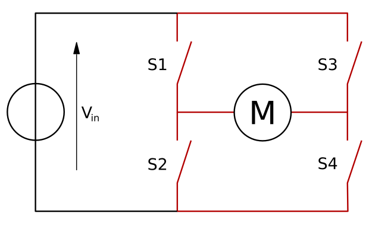

# H-Bridge

The Motor Shield is based on the L298, which is a dual full-bridge driver designed to drive inductive loads such as relays, solenoids, DC and stepping motors. It lets you drive two DC motors , controlling the speed and direction of each one independently.

## General

The term H bridge is derived from the typical graphical representation of such a circuit. An H bridge is built with four switches \(solid-state or mechanical\). When the switches S1 and S4 \(according to the first figure\) are closed \(and S2 and S3 are open\) a positive voltage will be applied across the motor. By opening S1 and S4 switches and closing S2 and S3 switches, this voltage is reversed, allowing reverse operation of the motor.

Using the nomenclature above, the switches S1 and S2 should never be closed at the same time, as this would cause a short circuit on the input voltage source. The same applies to the switches S3 and S4. This condition is known as shoot-through.



