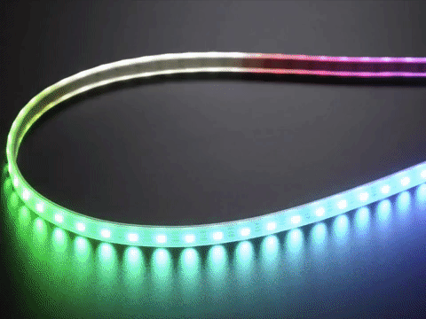

# LED-Strip

## Adafruit Digital RGBW Led Strip

* 144 LEDs per meter
* Maximum 5V @ 60mA draw per LED \(all LEDs on full brightness\)
* 5VDC power requirement \(do not exceed 6VDC\) - no polarity protection!
* 1 integrated RGB LEDs per segment, individually controllable
* LED wavelengths: 630nm/530nm/475nm
* Connector: [3-pin JST SM](http://www.jst-mfg.com/product/detail_e.php?series=238)
* Strip Width: 15mm / 0.6"
* Strip Thickness: 4mm / 0.16"
* Weight: 35.42g
* [WS2812 Datasheet](https://cdn-shop.adafruit.com/datasheets/WS2812.pdf)
* [SK6812 Datasheet](https://www.adafruit.com/images/product-files/1138/SK6812%20LED%20datasheet%20.pdf)
* May ship with either WS2812B or SK6812-based LEDs. They are the same brightness, color and protocol

## Integration

The Neopixels are implemented in the car to have an easy and quick respons.

## Calculation

## Code

## Currilicum

## Datasheets

