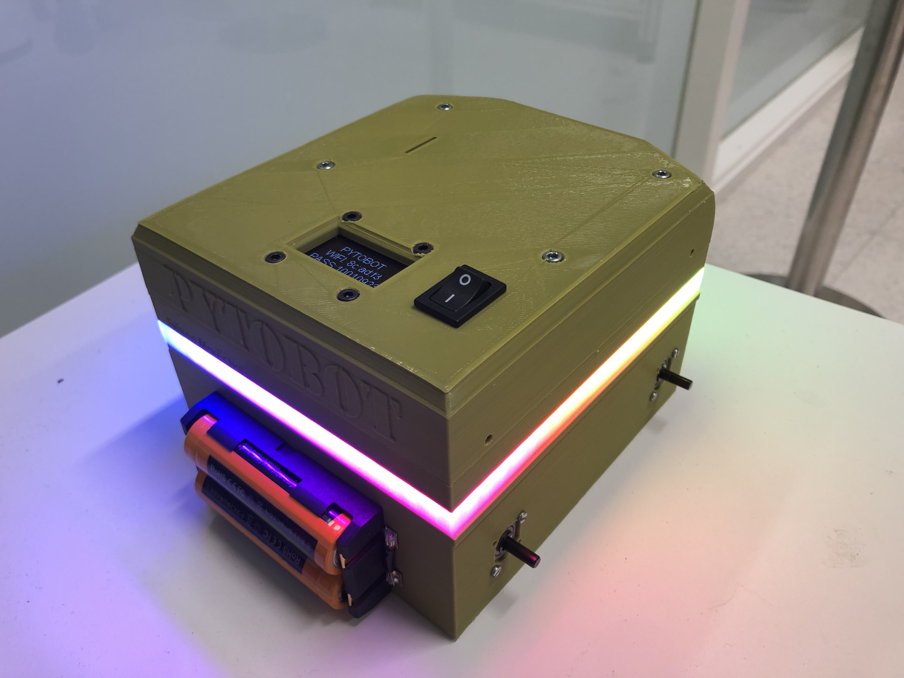

# Design


INSERT GIF OF 3D DESIGN


## About

**3D printing** is an innovative technology that creates a **physical object** from ****a **digital model**. It started in the 80’s under the name _‘rapid prototyping’,_  because the purpose of the technology was: to **prototype** **faster** and **cheaper**. A lot’s changed since then, and today's 3D printers offer amazing results and let you create anything you can imagine.

> With 3D printing, complexity is free. The printer doesn't care if it makes the most rudimentary shape or the most complex shape, and that is completely turning design and manufacturing on its head as we know it.  
> _'Avi reichental' \(CEO of 3D Systems\)_

## Integration

One of the main advantages in this project is the speed at which parts can be produced compared to traditional manufacturing methods.

Additive manufacturing at low volumes is very competitively costed compared to traditional manufacturing. For the production of prototypes that verify form and fit, it is significantly cheaper than other alternative manufacturing methods.


In 2015 alone, more than 278,000 additive manufacturing printers valued under $5000 were sold globally. The number of printers sold doubled consistently since.


## **ST**ereo**L**ithography \(STL\)

The most common [3D printer](https://www.lifewire.com/3d-printers-ratings-2265) file format is the.STL file. The file format is believed to have been created by 3D Systems from its **ST**ereo**L**ithography CAD software and machines.

An easy-to-understand definition of the STL file format is to see it as a **triangular** **representation** of a 3D object. A CAD drawing shows smooth lines for the circles, while an STL drawing shows the surface of that circle as a series of connected triangles.

## Download

| Name  | Download | Material | Quantity  |
| :--- | :--- | :--- | :--- |
| Top.stl | DOWNLOAD | ABS | 1 |
| Bottom.stm | DOWNLOAD | ABS | 1 |
| Wheel\_left.stl | DOWNLOAD | ABS | 2 |
| Wheel\_right.stl | DOWNLOAD | ABS | 2 |
| Tire.stl | DOWNLOAD | TPE | 4 |

## Print Version 1

### Remarks

While working with the on design it was possible to see any problems and where to improve the design.

1. The width of the switch needs to be 2mm wider.
2. To have an easier way to assemble it's better to provide a place for the screw head.
3. The battery holder needs an extra hole in the upper corner on the left. 
4. Add an on/off LED when the switch is on. 
5. The top needs to be tighter to the bottom.
6. Possibility to crew top and bottom. 
7. Add screws for the distance sensor.
8. The holes for the motor gear can be smaller in the wall. 
9. Add holes with standoffs for the PCB.
10. Distance sensor 5mm more in the wall.
11. Cover out-coming Batteries.
12. Renew motors.
13. Add brandname.
14. Line Sensors Lower.
15. Add an LED strip.

## Print Version 2

1. Add cover for the Batteries.
2. Higher the stands for H-Bridge.
3. Add Line sensor extension.
4. Add Camera Mount.
5. Add cooling Vans.
6. Better way to wire the LEDs.
7. Update wheels with new motors.
8. Add screws for the distance sensor.
9. Higher standoffs for the PCB.
10. Add holes and standoffs for the 9DoF.

## Reference List

3D Printing- Ultimaker \[[SOURCE](https://ultimaker.com/en/explore/what-is-3d-printing)\]  
STL Files- Lifewire \[[SOURCE](https://www.lifewire.com/stl-files-2255)\]

