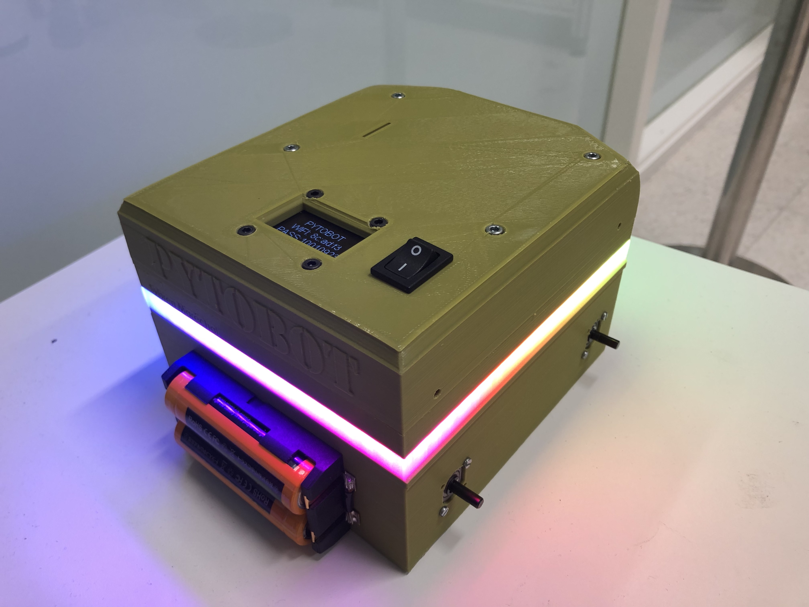

# Led Strip

## Digital RGBW Led strip

Pytobot has 72 Led's included in the hardware. The Led's give a more visible image of what is happening behind the software of the car. 



## Calculation

| Emitting color | Wavelength\(nm\) | Luminous intensity\(mcd\) | Current\(mA\) | Voltage\(V\) |
| :--- | :--- | :--- | :--- | :--- |
| Red | 620-630 | 550-700 | 20 | 1.8-2.2 |
| Green | 515-530 | 1100-1400 | 20 | 3.0-3.2 |
| Blue | 465-475 | 200-400 | 20 | 3.2-3.4 |


The max rating has assumed all the led's are on full width, usually the actual current for full color design is about 1/3 to 1/2 the max current.


$$
72*(20+20+20)=4320mA
$$

$$
4320mA/2=2160mA
$$

## Code

```python
import board
import neopixel

pixel_pin = board.D18
num_pixels = 10
ORDER = neopixel.RGB

pixels = neopixel.NeoPixel(pixel_pin, num_pixels, brightness=0.2, auto_write=True,
                           pixel_order=ORDER)
while True:
   pixels.fill((255, 255, 255)) ##White
   time.sleep(1)
```

## Datasheet




