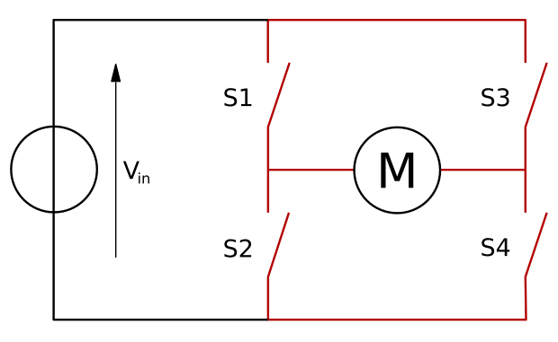

# Motor

## Integration

The motors are included in the robot to create more feedback of programming in a fun and interactive way. To have a bigger accomplichment and satiscfingn feeling by changing the position of the car. 

## Motor Controller

The Motor Controller is based on the L298, which is a dual full-bridge driver designed to drive inductive loads. It drives two DC motors , controlling the speed and direction of each one independently by PWM.

## H-Bridge

The term H bridge is derived from the typical graphical representation of such a circuit. An H bridge is built with four switches \(solid-state or mechanical\). When the switches S1 and S4 \(according to the first figure\) are closed \(and S2 and S3 are open\) a positive voltage will be applied across the motor. By opening S1 and S4 switches and closing S2 and S3 switches, this voltage is reversed, allowing reverse operation of the motor.

## Motor

The H-Bridge connets 2X2 DC 6-12V Motors, .   
The motors has a maximum \(**r**evolutions **p**er **m**inute\) RPM of 789 on 12V input. The H-bridge has a 7.2V input from the battery's that reduces the RPM of the motors. To have a more preciece control of the speed of each Motor. PWM is included from the H-Bridge.  

## References

H-Bridge- Wikipedia\(5/06/19\)\[SOURCE\]

## Datasheet



