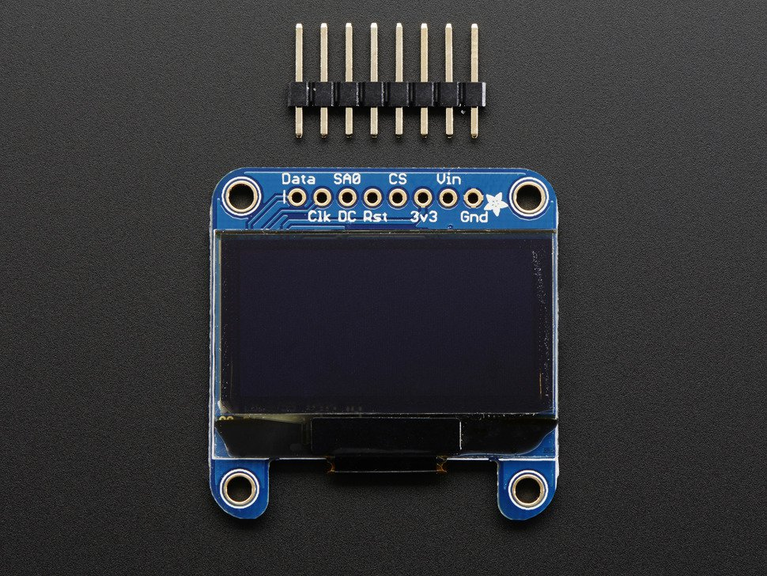
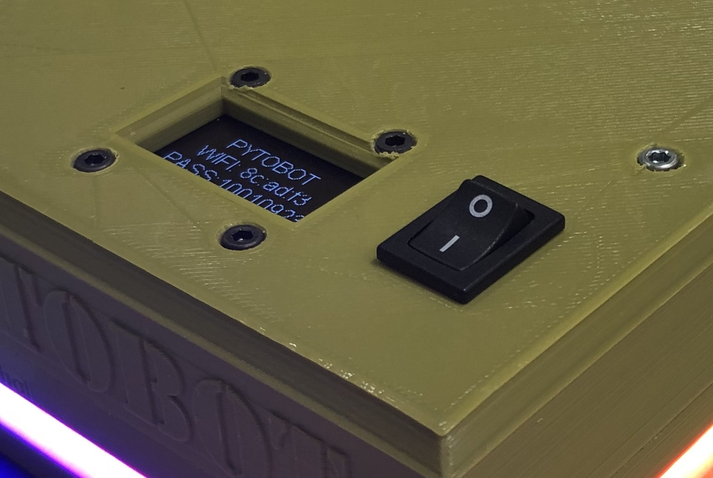
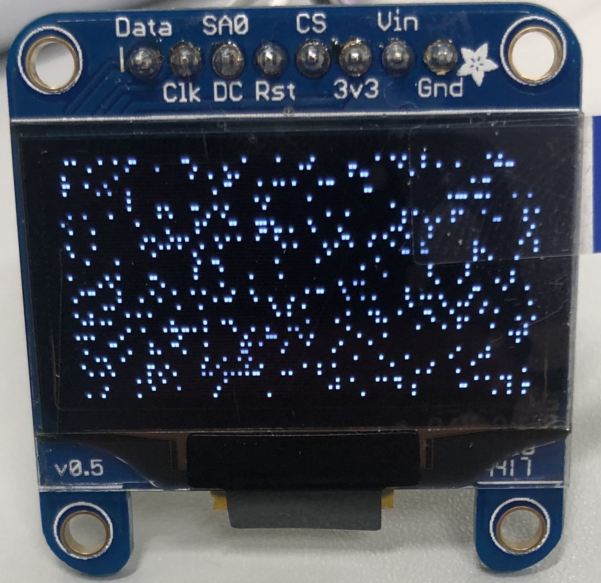
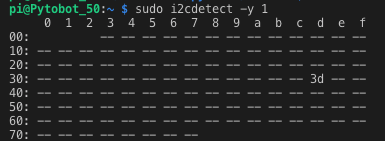

# OLED

## OLED

This display is made of 128 x 64 individual white OLED pixels, each one is turned on or off by the controller chip. The driver chip, SSD1306 can communicate in two ways: I²C or SPI. The OLED itself require a 3.3V power supply and 3.3V logic levels for communication.



## Integration

The OLED is used to have the first communication and indication with the client. The OLED will privide the first connection an control explanation. 

The Oled will respond while **booting**, **shutdown**, **local network** setup and **low battery** power. 

## Code local network communication

```python
def Print(self):
        self.mac = "ifconfig eth0 | grep -Eo ..\(\:..\){5} | tail -c 9"
        self.MAC = subprocess.check_output(self.mac, shell=True).decode("utf-8")
        self.passwd = "grep wpa_passphrase /etc/hostapd/hostapd.conf | tail -c 9"
        self.PASSWD = subprocess.check_output(self.passwd, shell=True).decode("utf-8")

        self.draw.text((self.x, self.top+10), "PYTOBOT \n" +"WIFI: " + self.MAC + "PASS:" + self.PASSWD, font=self.font, fill=255, align="center")

```



## Troubleshooting 

### Scrambled Screen

If the screen has all scrambled white dots over it, there is a high chance that the Reset pin is in a flying stage or not connected correctly. 



#### Adding hardware reset pin

If you have a reset pin \(which may be required if your OLED does not have an auto-reset chip like the FeatherWing\) also pass in a reset pin like so:

```python
import digitalio
import board
 
reset_pin = digitalio.DigitalInOut(board.D4) # any pin!
oled = adafruit_ssd1306.SSD1306_I2C(128, 32, i2c, reset=reset_pin)
```




### No I2C Device


ValueError: No I2C device at address: 3d


**`sudo i2cdetect -y 1`**

You should see the following, indicating that address **0x3d** \(the OLED display\) was found





```text
disp = adafruit_ssd1306.SSD1306_I2C(128, 64, i2c, addr=0x3d)
```




Change the address: "**addr=0x3d**" to the addres what whas found in the _I2Cdetect_


## Datasheet



