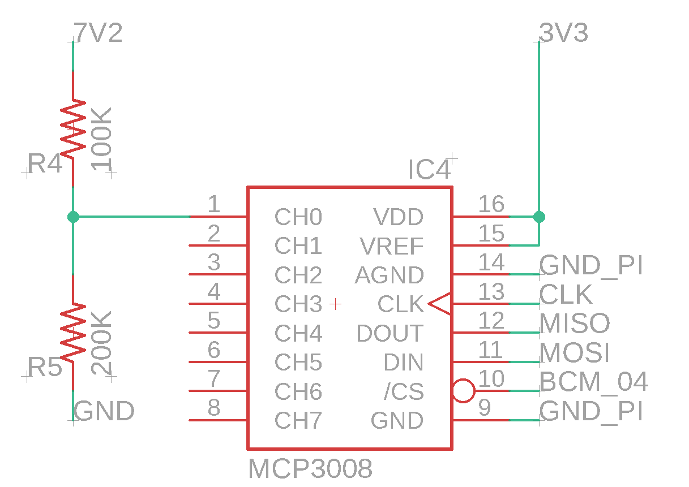
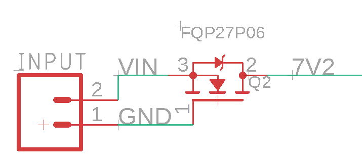

# Battery input

## FENIX ARB-L18-3400 RECHARGEABLE 18650 BATTERY

The Fenix ARB-L18-3400 is a high capacity 18650 Li-ion rechargeable with a protection circuit in the anode to help prevent short circuits, over charge/discharge and over heating. The battery also includes pressure relief vents which expel waste gas in the rare case of an internal short circuit preventing an explosion.

## **Integration in the project.**

To to use the the Motors an 6-12V input is required. For this project and max speed of the motors 2X 3.6V batteries are used what gives an 7.2V input voltage with 3400mAh. 


On full power the robot batteries can last for approximately 45 minutes


## Battery Voltage

To be able to secure the components and the controller. A voltage detection is needed to shutdown the circuit when the batteries drop below the minimum voltage. 


The Raspberry Pi doesn’t have ****a way to read analog inputs. It's a digital-only device.


To solve the problem of only analoge in. An ADC is a added to convert Analoge to Digital.

### Voltage Divider

A voltage divider circuit is a very common circuit that takes a higher voltage and converts it to a lower one by using a pair of resistors. The formula for calculating the output voltage is based on Ohms Law and is shown below.

$$
Vout = \frac{Vs*R5}{R4+R5}
$$

$$
5V ≈ \frac{7V2*150K}{100K+150K}
$$

### Code

The following code shutdown the raspberry Pi when the voltage goes under 5V. 

## Polarity Protection

when Gate = '0' voltage will go source to the drain.  
When Gate = '1' The voltage would not go the drain



