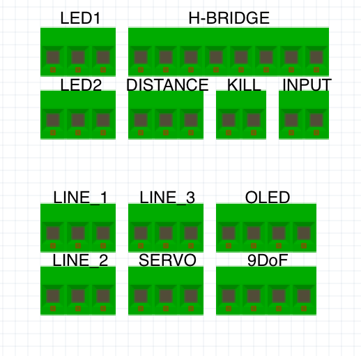

# Soldering / Assembling

## Assembling the project

By connecting the sensors and motors with Screw terminals it makes the connection really easy.  

## Input

| Connector | Oled |
| :--- | :--- |
| 1 | GND |
| 2 | VCC |

## H-Bridge

| Connector | H-Bridge |
| :--- | :--- |
| 1 | H-bridge EN1 |
| 2 | H-bridge IN1 |
| 3 | H-bridge IN2 |
| 4 | H-bridge IN3 |
| 5 | H-bridge IN4 |
| 6 | H-bridge EN2 |
| 7 | VCC 12V |
| 8 | GND |

## Line Sensor 1

| Connector | Line\_1 |
| :--- | :--- |
| 1 | GND |
| 2 | OUT |
| 3 | VCC |

## Line Sensor 2

| Connector | Line\_2 |
| :--- | :--- |
| 1 | GND |
| 2 | OUT |
| 3 | VCC |

## Line Sensor 3

| Connector | Line\_1 |
| :--- | :--- |
| 1 | GND |
| 2 | OUT |
| 3 | VCC |

## Servo

| Connector | Servo |
| :--- | :--- |
| 1 | GND \(Brown\) |
| 2 | PWM \(Orange\) |
| 3 | VCC \(Red\) |

## Distance Sensor

| Connector | Distance\_Sensor |
| :--- | :--- |
| 1 | GND |
| 2 | OUT |
| 3 | VCC |

## Oled

| Connector | Oled |
| :--- | :--- |
| 1 | GND |
| 2 | SLA |
| 3 | SLC |
| 4 | VCC |

## 9DOF

| Connector | 9DOF |
| :--- | :--- |
| 1 | GND |
| 2 | SLA |
| 3 | SLC |
| 4 | VCC |

