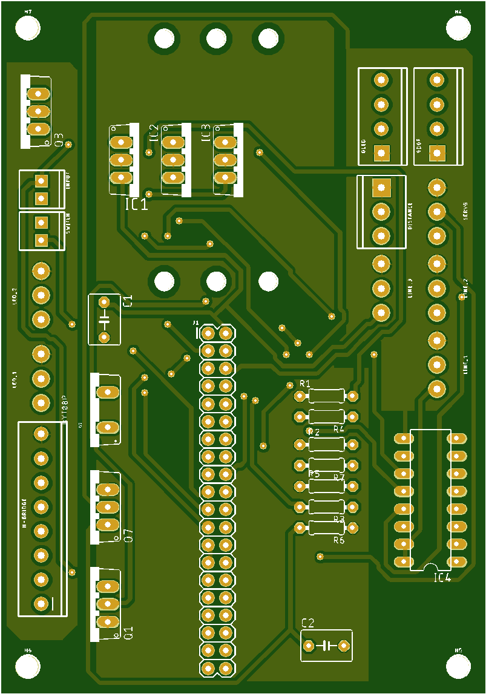
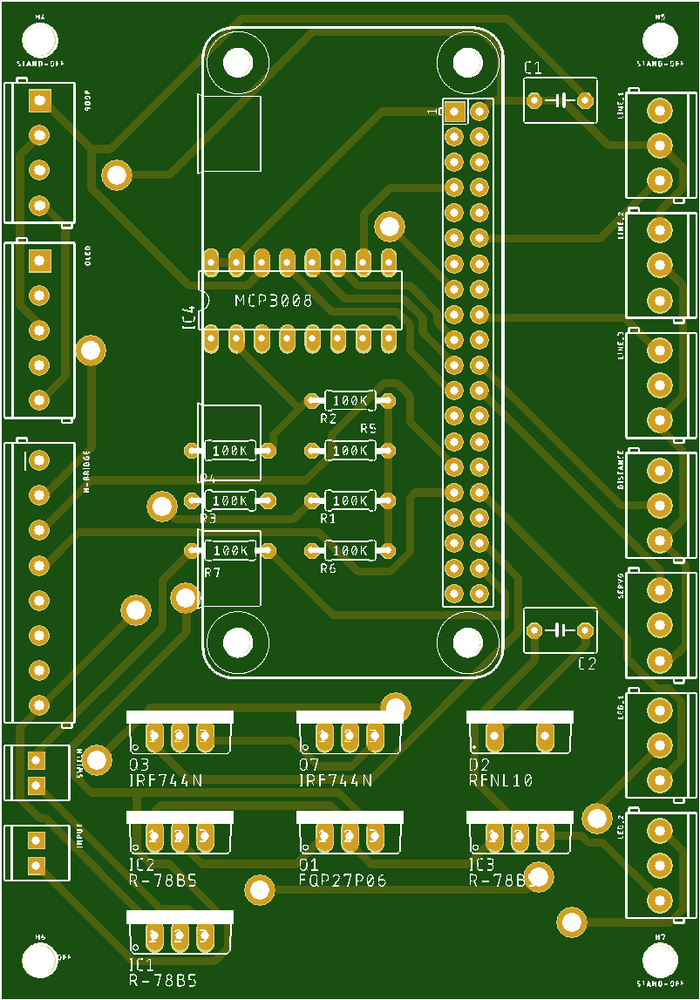

# Versions

## Version 0.1

Controlling of the H-Bdridge and the motors. 

## Version 0.2

Controlling H bridge, Motors and 2 LED strips.

## Version 0.3

Controlling H-Bridge, Motors, LED's Line Sensor's Distance Sensor, Oled, GDoF

## Version 0.4

Controlling H-Bridge, Motors, LED's Line Sensor's Distance Sensor, Oled, GDoF,  
On/Off Switch. 

## Version 0.5 PCB 

Controlling H-Bridge, Motors, LED's Line Sensor's Distance Sensor, Oled, GDoF,  
On/Off Switch.  

## Version 1.0 PCB

### Improvements

While Testing the first 1.0 PCB some minor and major eassues came up. 

1. Make use of smaller Via's
2. The screws From the Raspberry Pi zero change to wither.
3. Distance sensor on pin RX
4. Lower the electronics so the camera camble can fit in the raspberry Pi
5. Change the moter circuit to the raspberry Pi circuit. dont need Q3 anymore
6. IC1 higher because the fet comes out of the pcb
7. Change some io's to have less via's.
8. Change the value of the Restores
9. Add positve and negative side at the capacitor sine
10. Change the value of the capacitors
11. change the 2 pin screw connectors to the right size

