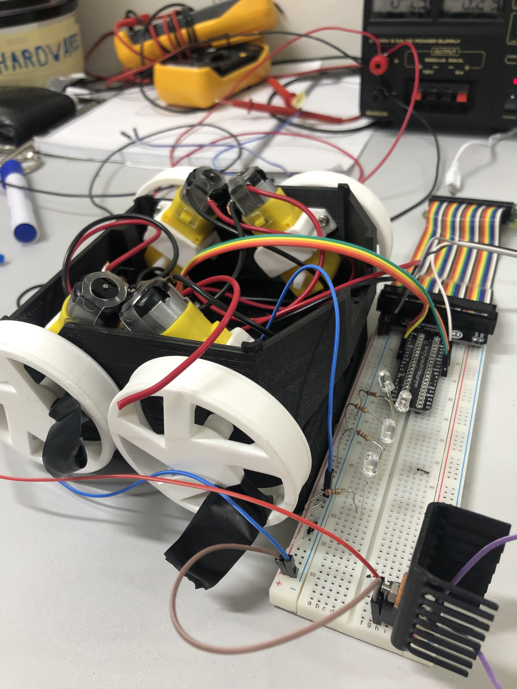
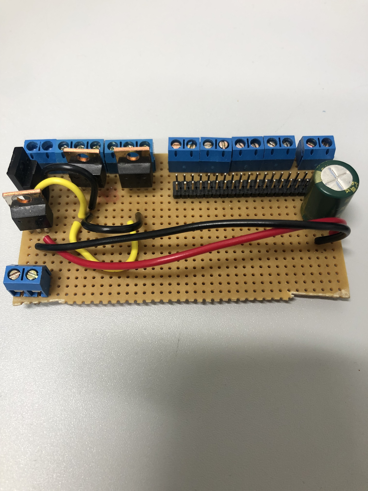
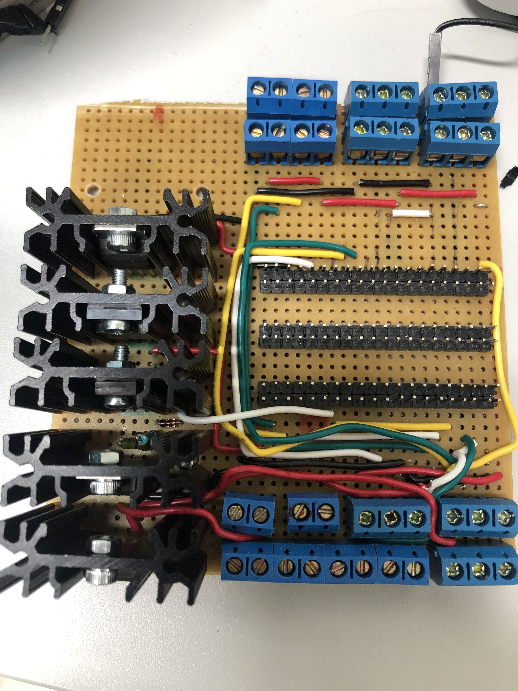
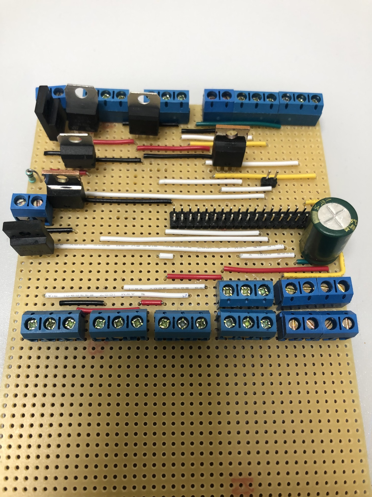
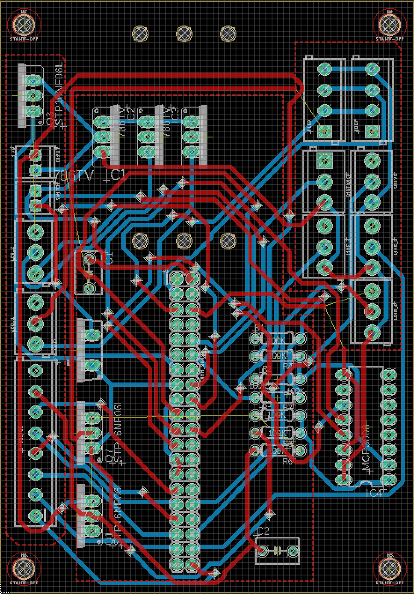

# Versions

## Version 0.1

Controlling of the H-Bdridge and the motors. 

## Version 0.2

Controlling H bridge, Motors and 2 LED strips.

## Version 0.3

Controlling H-Bridge, Motors, LED's Line Sensor's Distance Sensor, Oled, GDoF

## Version 0.4

Controlling H-Bridge, Motors, LED's Line Sensor's Distance Sensor, Oled, GDoF,  
On/Off Switch. 

## Version 1.0 PCB 

Controlling H-Bridge, Motors, LED's Line Sensor's Distance Sensor, Oled, GDoF,  
On/Off Switch.  

