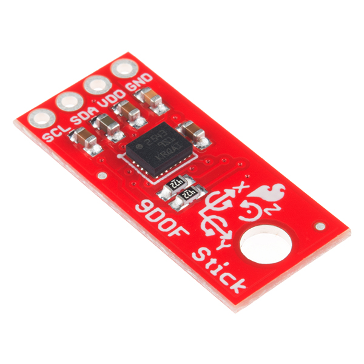

# Sparkfun 9DoF sensor stick

## Description

The SparkFun 9DoF Sensor Stick is an easy-to-use 9 Degrees of Freedom IMU. The Sensor Stick deftly utilizes the LSM9DS1 motion-sensing system-in-a-chip, the same IC used in the [SparkFun 9DoF IMU Breakout](https://www.sparkfun.com/products/13284). It houses a 3-axis accelerometer, 3-axis gyroscope, and 3-axis magnetometer – nine degrees of freedom \(9DoF\) in a single IC!

The onboard LSM9DS1 is equipped with a digital interface, but even that is flexible. The biggest difference between the two boards, besides the slimmed down 0.9"x0.4" footprint, is the number of broken-out pins, with the Sensor Stick featuring only four for quick setup and ease of use.

The LSM9DS1 is one of only a handful of ICs that can measure three key properties of movement – angular velocity, acceleration and heading – in a single IC. By measuring these three properties, you can gain a great deal of knowledge about an object’s movement and orientation. The LSM9DS1 measures each of these movement properties in three dimensions. That means it produces nine pieces of data: acceleration in x/y/z, angular rotation in x/y/z, and magnetic force in x/y/z.

Each sensor in the LSM9DS1 supports a wide spectrum of ranges: the accelerometer’s scale can be set to ± 2, 4, 8, or 16g, the gyroscope supports ± 245, 500, and 2000°/s, and the magnetometer has full-scale ranges of ± 4, 8, 12, or 16 gauss.

## Features

* 3 acceleration channels, 3 angular rate channels, 3 magnetic field channels
* ±2/±4/±8/±16g linear acceleration full scale
* ±4/±8/±12/±16 gauss magnetic full scale
* ±245/±500/±2000dps angular rate full scale
* I2C serial interface
* Operating Voltage: 3.3V

## Documents

* [Schematic](https://cdn.sparkfun.com/datasheets/Sensors/IMU/SparkFun_9DoF_Sensor_Stick_v21.pdf)
* [Eagle Files](https://cdn.sparkfun.com/datasheets/Sensors/IMU/SparkFun_9DoF_Sensor_Stick_v21.zip)
* [Hookup Guide](https://learn.sparkfun.com/tutorials/9dof-sensor-stick-hookup-guide)
* [Datasheet](https://cdn.sparkfun.com/assets/learn_tutorials/3/7/3/LSM9DS1_Datasheet.pdf) \(LSM9DS1\)
* [GitHub](https://github.com/sparkfun/9DOF_Sensor_Stick/tree/new_rev)

