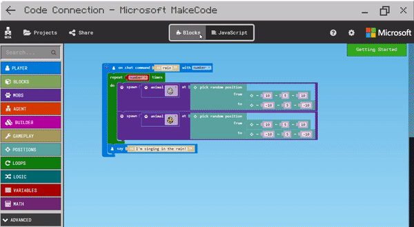

# programming

### NodeRed

**Node-RED** is a [flow-based](https://en.wikipedia.org/wiki/Flow-based_programming) development tool for [visual programming](https://en.wikipedia.org/wiki/Visual_programming_language) developed originally by [IBM](https://en.wikipedia.org/wiki/IBM) for wiring together hardware devices, [APIs](https://en.wikipedia.org/wiki/Application_programming_interface) and [online services](https://en.wikipedia.org/wiki/Online_services) as part of the [Internet of Things](https://en.wikipedia.org/wiki/Internet_of_Things).

###  Blockly

**Blockly** is a client-side [JavaScript](https://en.wikipedia.org/wiki/JavaScript) library for creating [visual block programming languages](https://en.wikipedia.org/w/index.php?title=Visual_block_programming_languages&action=edit&redlink=1) and editors. It is a project of [Google](https://en.wikipedia.org/wiki/Google) and is [open-source](https://en.wikipedia.org/wiki/Open-source) under the [Apache 2.0 License](https://en.wikipedia.org/wiki/Apache_2.0_License).[\[1\]](https://en.wikipedia.org/wiki/Blockly#cite_note-1) It typically runs in a web browser, and visually resembles [Scratch](https://en.wikipedia.org/wiki/Scratch_%28programming_language%29)

## Microsoft MakeCode

**Microsoft MakeCode** is a framework for creating domain-specific programming experiences for beginners.  
Microsoft MakeCode is based on the open source project [Microsoft Programming Experience Toolkit \(PXT\)](https://github.com/Microsoft/pxt):

