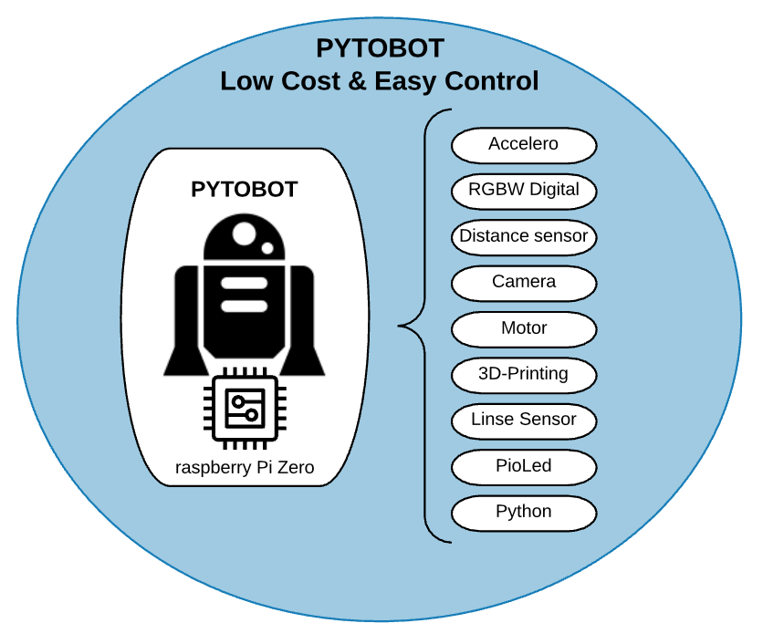

# Pytobot

## Intro

**Pytobot** is a DIY 3D-print **low-cost Rover** that will bring you step by step into the world of IoT.   
It takes electronics, 3D modeling and IoT together into a tailor-made project ****for **kids.**

**Programming** can be quite overwhelming for starters. The Pytobot makes step smaller and becomes programming more **accessible for children**.   
With a full **REST interface** that controlls the robot, you will be able to have control on multiple ways for different levels of programming. 

## Communication and Control 

The Pytobot is build on a **REST interface and JSON communication**.   
This gives the advantage that the Pytobot can be **controlled** from **any framework and program** that is connected to the **network** of the Raspberry Pi. 


JSON is an [open-standard](https://en.wikipedia.org/wiki/Open_standard) [file format](https://en.wikipedia.org/wiki/File_format) that uses [human-readable](https://en.wikipedia.org/wiki/Human-readable_medium) text to transmit data objects


### RESTful API

The Rest interface is used to **communicate** from the **frontend** \(controller\) to the **backend** \(Pytobot\). A RESTful API is an application program interface \(API\) that uses **HTTP Requests** to communicates through the network.

### Network

To **control** the robot **through** **the** **network**, The raspberry Pi will proceed as an router and **Acces** **Point**. By accessing in the same network as the Robot. The REST communication is active and the connection from the controller to the Backend is establiched 

To connect to the network an **SSID** and **password** will be printed out on the **Oled Screen** on the robot. When connected to the hotspot, a browser will pop up and will show the features of the project. 

* * 
